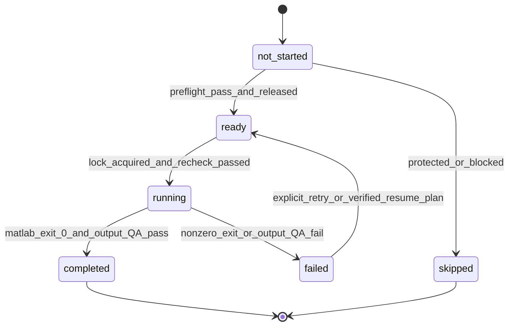

# GNSS SAGE Batch Dry-Run 设计

## 1. 文档目的与安全边界

本文设计一个正式批量 SAGE 运行之前使用的只读规划工具。该工具从 `dataset/dataset_inventory.csv` 构建 `scene × PRN` 任务清单，解析实际输入路径，执行完整性和防覆盖检查，估算计算规模，生成可审计的 batch plan，但不调用 MATLAB、不运行 Stage0–Stage4，也不写入任何 scene 目录。

本设计基于以下现有文件进行只读分析：

- `docs/MULTIPATH_EVENT_DATABASE_DESIGN.md`
- `dataset/dataset_inventory.csv`
- `scenes/F1023_V70_D0117_P2/sage_results/reference_scene_final_validation_report.md`
- `scripts/sage_pipeline/run_nav_sage_pipeline.m`
- `scripts/sage_pipeline/summarize_prn_validation.py`
- `scripts/sage_pipeline/g06_nav_sage_pipeline.m`

当前 `scripts/sage_pipeline/` 中没有 batch planner 或 batch runner。本文提到的工具名和输出目录均为后续建议，目前不代表文件已经存在。

安全边界：

- 不修改 `run_nav_sage_pipeline.m` 或任何 pipeline 参数。
- 不修改 metadata、inventory、raw、GNSS-SDR、navigation、trajectory、satellite geometry。
- 不创建、删除、重命名或补写任何已有 SAGE 结果目录。
- dry-run 只允许向新的规划/日志目录写入 plan、report、manifest 和状态记录。
- reference scene `F1023_V70_D0117_P2` 及 `G06_nav_sage_v1` 始终视为受保护基线。

## 2. 当前 inventory 规划快照

从当前 `dataset_inventory.csv` 可得到：

| 项目 | 当前数量 |
|---|---:|
| Scene 总数 | 19 |
| 10.23 MHz scene | 13 |
| 20.46 MHz scene | 6 |
| Scene-PRN 逻辑任务总数 | 124 |
| 10.23 MHz 逻辑任务 | 83 |
| 20.46 MHz 逻辑任务 | 41 |
| Reference scene 已封存任务 | 7 |
| Standard scene 待规划逻辑任务 | 117 |
| Inventory 中 PRN 对应多个 channel 的任务 | 5 |
| `nav_mapping_without_tracking_start` warning 条目 | 6 |

当前五个多 channel 任务为：

| Scene | PRN | Inventory channel candidates |
|---|---|---|
| `F1023_V120_D0121_P2` | G06 | 6, 9 |
| `F1023_V120_D0121_P2` | G12 | 5, 11 |
| `F1023_V120_D0121_P2` | G19 | 0, 1, 3 |
| `F1023_V120_D0121_P2` | G29 | 3, 10 |
| `F1023_V70_D0120_P9` | G23 | 3, 10 |

当前六条 tracking-start warning 涉及：

- `F1023_V120_D0121_P2 / G06 / ch6`
- `F1023_V120_D0121_P2 / G12 / ch5`
- `F1023_V70_D0120_P9 / G23 / ch10`
- `F1023_V80_D0117_P8 / G29 / ch9`
- `F2046_V30_D0131_P2 / G29 / ch0`
- `F2046_V30_D0131_P2 / G31 / ch2`

前三条与多 channel 任务重叠。按最保守的 inventory-only 规则，排除 7 个 reference 任务、5 个多 channel 任务和另外 3 个唯一映射但带 tracking-start warning 的任务后，最多有 109 个 standard scene 任务可进入下一层文件检查。**109 不是最终 ready 数量**；raw、channel-specific tracking/telemetry、navigation、trajectory、geometry、输出冲突和运行环境仍需逐项检查。

所有 standard scene 的 raw storage 当前均为 `external_storage`，reference scene 为 `scene_local`。因此正式 dry-run 必须实际检查外部 raw 路径可访问，不能只相信 inventory 中的字符串。

## 3. 从 inventory 生成 scene-PRN 任务列表

### 3.1 权威字段

任务规划器读取以下 inventory 字段：

- Scene：`scene_id`, `scene_role`, `signal_type`, `sampling_rate_hz`
- Raw：`raw_path`, `raw_storage_mode`
- 处理状态：`gnss_sdr_status`, `tracking_exists`, `telemetry_exists`, `rinex_nav_exists`, `trajectory_exists`, `satellite_geometry_status`
- PRN：`available_prns`, `available_prn_count`
- Channel：`prn_tracking_channel_map`
- Navigation/trajectory：`rinex_nav_files`, `trajectory_files`
- Geometry：`satellite_geometry_file_count`, `satellite_geometry_prns`
- 历史结果：`sage_results_status`, `sage_results_exists`
- 异常：`inventory_warnings`

`tracking_channel_prn_map` 可以用于一致性检查，但生成任务时应优先使用面向 PRN 的 `prn_tracking_channel_map`。

### 3.2 生成算法

每个 inventory scene 按以下步骤处理：

1. 解析 `available_prns`，标准化为 `Gxx`，去重并排序。
2. 将 `prn_tracking_channel_map` 作为 JSON 解析，禁止用字符串切割猜测。
3. 对每个 `available_prn` 创建一个**逻辑任务记录**。
4. 检查该 PRN 在 map 中是否存在：
   - 恰好一个 channel：写入 `tracking_channel`，`channel_resolution_status=unique`。
   - 多个 channel：`tracking_channel` 留空，将候选写入 `tracking_channel_candidates`，任务不能自动 ready。
   - 没有 channel：任务保留在 plan 中，但标记 `missing_channel_mapping`。
5. 解析 task-specific `inventory_warnings`。warning 必须关联到 scene、PRN、channel，不能只作为 scene 级文本保存。
6. 根据唯一 channel 构造预期 tracking 和 telemetry 路径，再实际检查文件。
7. 构造 navigation、trajectory 和两张 satellite geometry 路径，并检查 PRN 是否出现在 `satellite_geometry_prns`。
8. 检查固定目标目录 `scenes/<scene_id>/sage_results/nav_sage_v2/<PRN>`。
9. 计算 preflight gates、估算规模、分配初始状态和优先级。

### 3.3 多 channel 不自动展开

规划器不应把一个多 channel PRN 自动展开为多个可执行任务，因为这会造成重复计算和不明确的物理含义。应保留一个逻辑任务，记录：

- `tracking_channel=null`
- `tracking_channel_candidates="6;9"`
- `channel_resolution_status=ambiguous`
- `blocking_reason=ambiguous_tracking_channel`

后续只能通过单独的、可审计的 resolution manifest 选择 channel。即使 inventory warning 表明某候选 channel 没有 tracking start，也不能仅靠删除该候选来静默确定另一个 channel；必须再核对对应 tracking/telemetry 内容并记录 `channel_resolution_method`。

### 3.4 Reference scene 处理

`scene_role=reference_scene` 的七个 PRN 必须进入 plan 以证明规划器看到了它们，但初始状态固定为：

```text
status=skipped
skip_reason=protected_reference_result
execution_allowed=false
```

它们不计入新 batch 的 completed 数量，也不得因为某个固定目标目录看似缺失而重新运行。例如 G06 的历史结果位于 `G06_nav_sage_v1`，仍然必须跳过。

## 4. Batch task 核心字段

建议 `batch_sage_plan.csv` 每个逻辑任务一行。字段分组如下。

### 4.1 身份与版本

| 字段 | 说明 |
|---|---|
| `plan_id` | 一次 dry-run 的不可变 ID |
| `task_id` | `scene_id + PRN + channel/ambiguous + namespace` 的稳定 ID |
| `scene_id`, `scene_role` | Scene 标识及保护规则来源 |
| `prn`, `constellation`, `prn_number` | 标准化卫星标识 |
| `tracking_channel` | 唯一确认的整数 channel；不明确时为空 |
| `tracking_channel_candidates` | 多 channel 候选列表 |
| `channel_resolution_status` | `unique`, `ambiguous`, `missing`, `manually_resolved` |
| `channel_resolution_method` | `inventory_unique`、后续人工/证据解析方法 |
| `pipeline_entrypoint` | 固定 `scripts/sage_pipeline/run_nav_sage_pipeline.m` |
| `pipeline_version` | 由 plan manifest 明确记录；不能仅从目录名推测 |
| `experiment_namespace` | 当前固定目标为 `nav_sage_v2` |
| `parameter_set_id` | 参数快照标识；运行前必须冻结 |
| `pipeline_sha256` | pipeline 文件内容指纹 |

### 4.2 输入路径与存在性

每个任务至少记录：

| 路径字段 | 对应检查字段 |
|---|---|
| `raw_path` | `raw_exists`, `raw_size_bytes`, `raw_storage_mode` |
| `tracking_path` | `tracking_exists`, `tracking_size_bytes` |
| `telemetry_path` | `telemetry_exists`, `telemetry_size_bytes` |
| `navigation_path` | `navigation_exists`, `navigation_size_bytes` |
| `trajectory_path` | `trajectory_exists`, `trajectory_size_bytes` |
| `satellite_timeseries_path` | `satellite_timeseries_exists`, `geometry_has_prn` |
| `satellite_summary_path` | `satellite_summary_exists`, `geometry_has_prn` |
| `metadata_path` | `metadata_exists`, `metadata_scene_match` |
| `output_path` | `output_collision_status` |

Channel-specific 预期路径规则为：

```text
scenes/<scene_id>/gnss_sdr/tracking/<scene_id>_track_ch_<channel>.mat
scenes/<scene_id>/gnss_sdr/telemetry/<scene_id>_telemetry_ch_<channel>.dat
```

Navigation、trajectory 和 geometry 应优先从 inventory/metadata 的实际记录解析；只在记录缺失时使用标准目录规则，并把 `path_resolution_method=convention_fallback` 写入 plan。

### 4.3 Preflight、估算和状态

| 字段 | 说明 |
|---|---|
| `sample_rate_hz`, `sample_rate_supported` | 10.23/20.46 MHz 及支持检查 |
| `preflight_status` | `pass`, `warning`, `blocked` |
| `hard_gate_failures` | 分号分隔的机器可读 code |
| `warning_codes` | 非阻断或待审阅问题 |
| `execution_allowed` | 只有全部 hard gate 通过才为 true |
| `estimated_valid_nav_symbols` | 估计的有效 NAV symbol 数 |
| `estimated_40ms_windows_low/typical/high` | 40 ms window 估计或区间 |
| `estimated_stage1_windows` | 通常等于预计 40 ms windows |
| `estimated_stage2_candidates_low/typical/high` | Stage2 候选规模 |
| `estimated_stage2_model_evaluations_*` | 候选数 × 4 |
| `sample_rate_factor` | `sample_rate_hz / 10230000` |
| `workload_units_low/typical/high` | 相对计算量，不代表分钟数 |
| `estimate_method`, `estimate_confidence` | 估算来源和可信度 |
| `priority_class`, `priority_rank` | 执行优先级 |
| `status`, `status_reason` | 状态机当前值 |
| `existing_result_status` | 已有目标目录检查结果 |
| `db_ingestion_status` | 后续入库状态，dry-run 初始为 `not_applicable` |

## 5. 进入 SAGE 前必须满足的条件

### 5.1 Hard gates

以下任何一项不满足，任务不得进入 `ready`：

1. `scene_id` 在 inventory 中唯一，scene 目录和 `metadata.json` 存在。
2. metadata 的 `scene_id` 与 inventory 一致。
3. `scene_role` 不是受保护 reference，或存在用户明确批准的独立新实验计划；默认 reference 全部跳过。
4. `gnss_sdr_status=SUCCESS`，tracking 和 telemetry scene-level 状态正常。
5. PRN 在 `available_prns` 中，且 `prn_tracking_channel_map` 有唯一、已验证 channel。
6. 没有未解决的 task-specific `inventory_warnings`。
7. raw 文件存在、可读且大小大于 0；外部 storage 在本次 dry-run 时实际可访问。
8. channel-specific tracking MAT 存在、可读且大小大于 0。
9. channel-specific telemetry DAT 存在、可读且大小大于 0。
10. RINEX NAV 存在、可读且大小大于 0。
11. trajectory NMEA 存在、可读且大小大于 0。
12. satellite elevation timeseries 和 summary 均存在，并覆盖该 PRN。
13. `sampling_rate_hz` 为当前 pipeline 支持的精确值；不得用 scene 名猜采样率。
14. 固定目标输出目录不存在。
15. `run_nav_sage_pipeline.m` 存在，执行前文件指纹与 plan manifest 一致。
16. 正式 runner 启动前 MATLAB、license、磁盘空间和 task lock 检查通过。

Satellite geometry 可能不是 SAGE 数值优化每一步的直接输入，但它是当前项目规定的 scene 完整性和后续事件上下文条件，因此在 batch policy 中仍作为 hard gate。

### 5.2 Warning-only checks

以下内容可以不直接阻断，但必须出现在 report：

- raw 位于外部磁盘，可能存在 I/O 波动；
- 20.46 MHz 尚无与 reference 七 PRN 同等级的多 PRN基线；
- 预计有效 NAV symbols 或 windows 很少；
- geometry 只能提供稀疏时间点；
- 无可靠实测速度，pipeline 将使用 fallback speed bound；
- 估算只能使用 reference prior，无法从 telemetry/tracking 获得高置信度覆盖长度。

## 6. 计算规模估算

Dry-run 只估算，不运行 Stage0–Stage4。所有估算必须保存 `estimate_method` 和区间，禁止把估算值写成实际计数。

### 6.1 40 ms windows

推荐按可信度使用四级方法：

1. `existing_stage0_exact`：仅用于已有结果的审计，直接读取 `stage0_valid_40ms_windows.csv` 行数；该任务仍因已有输出而跳过。
2. `telemetry_tracking_coverage`：只读解析 telemetry/track 的时间覆盖和有效 NAV symbol 连续性，估计可用于 Stage0 的 symbol 数；不读取 raw IQ 做相关运算。
3. `duration_based`：在原始复数 sample 格式和 bytes-per-sample 已明确时，用 raw/track/telemetry 的最短覆盖时间估算。
4. `reference_prior`：无法解析覆盖信息时使用 reference 分布，仅给低/中/高区间，置信度为 low。

Reference scene 的实际关系均为：

```text
40ms_windows = valid_nav_symbols - 2
```

因此 dry-run 可把 `max(estimated_valid_nav_symbols - 2, 0)` 作为 Pipeline V3 reference-derived 估算公式，但必须标记 `window_estimate_formula=reference_v1`，不能宣称对所有 scene 必然精确。

### 6.2 Stage1 规模

Stage1 对每个有效 40 ms window 执行 fast scan，因此：

```text
estimated_stage1_windows ≈ estimated_40ms_windows
```

Reference 七 PRN 中 Stage1 scanned 与 40 ms windows 一致。若正式结果不一致，应由入库 QA 检查 `scan_valid` 和 `error_message`，不能在 dry-run 中预先修正。

### 6.3 Stage2 规模

Reference 七 PRN 的 `Stage2 candidates / 40 ms windows` 比例为：

- 最低：G25，约 4.4%
- 中位附近：约 8.2%
- 最高：G06，约 29.8%

建议初始估算区间：

```text
candidates_low     = ceil(windows × 0.044)
candidates_typical = ceil(windows × 0.082)
candidates_high    = ceil(windows × 0.298)
model_evaluations  = candidates × 4
```

这些比例仅来自一个 reference scene，应在首批 standard scene 完成后重新校准并生成 `estimate_model_version=v2`，不得覆盖历史 plan 的 v1 估算。

### 6.4 相对 workload units

20.46 MHz 每个固定时间窗口包含约两倍于 10.23 MHz 的 samples。建议定义：

```text
sample_rate_factor = sample_rate_hz / 10230000
stage1_units = estimated_windows × sample_rate_factor
stage2_path_order_units = estimated_candidates × (1 + 2 + 3 + 4) × sample_rate_factor
workload_units = stage1_units + stage2_path_order_units
```

`1+2+3+4` 只是 L1–L4 的模型阶数代理，用来排序任务，不是经过实测的 wall-clock 模型。报告不得把 workload units 转换成分钟，除非未来用实际运行日志完成回归标定。

Stage3/Stage4 规模高度依赖传播特征。Dry-run 可以记录其上界和 unknown 状态，但不应根据 PRN 编号或环境猜测事件数。

## 7. 优先级设计

优先级必须在 hard gates 之后分配。推荐按以下顺序：

1. `pilot_10m_low_workload`：10.23 MHz、唯一 channel、无 warning、低/中 workload；优先每个 scene 选一个任务，避免先跑完单个 scene 的全部 PRN。
2. `pilot_10m_diversity`：补充不同 scene/PRN 的 10.23 MHz 样本，用于验证估算和入库。
3. `batch_10m`：其余通过门禁的 10.23 MHz 任务。
4. `pilot_20m`：少量 20.46 MHz 任务，单独验证 sample-rate 分支、内存、磁盘和运行时。
5. `batch_20m`：20.46 MHz pilot 通过后才释放。
6. `manual_resolution`：channel 歧义或 inventory warning 任务；在问题解决前不进入 runner。
7. `protected_or_existing`：reference 或已有输出，永久跳过本次 plan。

同一优先级内按以下稳定键排序：

```text
workload_units_typical, scene_id, prn, tracking_channel
```

当前 metadata 没有可靠 environment 标签，因此“场景多样性”在 dry-run 初期只能按不同 `scene_id` 控制，不能声称覆盖了不同环境类别。

## 8. Dry-run 输出文件

建议每次 dry-run 创建不可变目录：

```text
dataset_generation_logs/
└── batch_sage/
    └── <plan_id>/
        ├── batch_sage_plan.csv
        ├── batch_sage_plan_report.md
        ├── batch_sage_plan_manifest.json
        ├── batch_sage_plan_issues.csv
        └── source_inventory_snapshot.csv
```

当前设计阶段不创建这些文件。

### 8.1 `batch_sage_plan.csv`

机器可读的每任务计划表，包含第 4 节所有身份、路径、存在性、门禁、估算、优先级和初始状态字段。它是不可变计划快照；正式执行器不应在多进程中直接反复覆盖该 CSV。

### 8.2 `batch_sage_plan_report.md`

面向 AI Agent 和研究人员，至少报告：

- inventory snapshot、plan ID、pipeline hash 和参数集；
- scene/task 总数及 10.23/20.46 MHz 分布；
- ready、blocked、skipped 数量；
- 多 channel 任务清单；
- missing input 和 inventory warning 清单；
- existing/partial/unknown output collision 清单；
- workload low/typical/high 汇总和优先级队列；
- 需要人工决定的问题；
- 明确声明 dry-run 未运行 SAGE。

### 8.3 Manifest 与 issues

`batch_sage_plan_manifest.json` 保存嵌套的 pipeline、参数、inventory hash、生成时间、schema version、主机和规划规则版本。

`batch_sage_plan_issues.csv` 每个问题一行：

- `plan_id`, `task_id`
- `severity`: `warning` 或 `blocking`
- `issue_code`
- `message`
- `source_field`, `source_value`
- `resolution_status`, `resolution_notes`

`source_inventory_snapshot.csv` 是计划生成时的只读快照，防止未来 inventory 更新后无法解释旧计划；它不替代项目当前 inventory。

## 9. 任务状态管理

### 9.1 状态定义

| 状态 | 定义 |
|---|---|
| `not_started` | 已进入 plan，但尚未完成执行前门禁或尚未释放执行 |
| `ready` | 所有 hard gate 通过、输出为空、已获执行许可 |
| `running` | runner 已取得 task lock 并启动 MATLAB |
| `completed` | MATLAB 正常退出，Stage0–Stage4 完成性和结果 QA 通过 |
| `failed` | MATLAB 非正常退出、超时或完成性 QA 失败；保留所有 checkpoint/中间结果 |
| `skipped` | 本 plan 不执行，例如 protected reference、已有完整结果、未解决 channel、明确人工排除 |

`skipped` 必须有 `skip_reason`。`failed` 与 `skipped` 不可互换；输入缺失在 dry-run 中通常为 `skipped/blocked_preflight`，启动后出错才是 `failed`。

### 9.2 状态转换



禁止 `completed → running`。需要重跑时必须生成新 plan/version，而不是复用旧任务状态。

### 9.3 状态存储

保持 `batch_sage_plan.csv` 不变，正式执行时新增：

```text
batch_sage_status_history.jsonl   # append-only 状态事件
batch_sage_state.csv              # 从 history 物化的当前状态视图
logs/<task_id>.log                # MATLAB stdout/stderr
```

每个状态事件记录 `task_id`、旧/新状态、时间、attempt、worker、PID、exit code、log path 和 reason。状态 history 不写入 scene 目录。

## 10. 防止覆盖已有结果

当前通用 pipeline 的结果目录规则是：

```text
scenes/<scene_id>/sage_results/nav_sage_v2/<PRN>
```

在不修改 pipeline 的前提下，batch runner 必须把该固定目录视为唯一目标，并在三个时间点检查：plan 生成时、任务进入 ready 时、MATLAB 启动前取得 lock 后。

输出目录分类：

| `output_collision_status` | 处理 |
|---|---|
| `absent` | 可继续其他门禁 |
| `complete_existing` | `skipped`; 不调用 MATLAB |
| `partial_existing` | 默认 `skipped`; 保留 checkpoint，等待显式 resume plan |
| `unknown_existing` | blocking；人工检查目录内容 |
| `protected_reference` | 永久 blocking/skip |

防覆盖规则：

- 只要目标目录存在，普通 `execution_mode=new` 就不得调用 pipeline。
- 不以 `sage_results_status=not_run` 代替实际目录检查。
- 不删除 partial 目录，不清理 checkpoint，不创建同名空目录。
- Resume 必须是单独授权的 `execution_mode=resume`，并验证现有 `run_context.json` 的 scene、PRN、channel、sample rate、pipeline/参数指纹与当前 task 一致。
- 两个 worker 通过 plan 状态目录中的原子 task lock 防止竞态；lock 前后都要重查目标目录。
- reference scene 即使某个 `nav_sage_v2/Gxx` 目录不存在，也因保护策略跳过。

由于 pipeline 当前固定写入 `nav_sage_v2/<PRN>`，未来需要相同 scene-PRN 的新参数实验时，必须先设计新的版本化输出机制并获得明确授权；batch runner 不能通过移动、改名或覆盖旧目录绕过这一限制。

## 11. 正式 batch runner 调用 MATLAB 的设计

任务只有在 `status=ready` 后才可执行。逻辑 MATLAB 调用为：

```matlab
addpath("E:\GNSS_Multipath_Project\scripts\sage_pipeline");
run_nav_sage_pipeline(sceneId, PRN, TrackingChannel, ProjectRoot);
```

例如参数值由 plan 的 typed fields 提供：

```matlab
run_nav_sage_pipeline("F1023_V70_D0117_P4", "G11", 2, "E:\GNSS_Multipath_Project");
```

推荐 runner 使用一个独立 MATLAB `-batch` 进程执行一个任务，并记录进程 exit code。执行器要求：

1. `scene_id` 只允许 inventory 中的精确值；PRN 必须匹配 `^G[0-9]{2}$`；channel 必须为允许范围内整数。
2. `ProjectRoot` 固定为 manifest 中的规范化根路径，不从任意 task 文本接受 shell 片段。
3. 启动前重新计算 pipeline hash，并与 plan 一致。
4. 先获取 task lock，再检查输出目录仍为 absent。
5. 记录 MATLAB 版本、主机、PID、开始时间、结束时间和 exit code。
6. 首批 pilot 串行执行；只有完成 CPU、内存、磁盘和 raw I/O profiling 后才能提高并发。
7. 中断或失败后不删除输出目录；checkpoint 和已有 Stage 中间结果全部保留。
8. 不根据非零 exit code自动重跑。重试必须新建 attempt 记录，resume 需要显式策略。

MATLAB shell 命令的引号和转义应由 runner 使用固定模板构造；不得把 CSV 整行直接拼接成 shell 命令。

## 12. 完成性检查

MATLAB exit code 0 只是必要条件。任务进入 `completed` 前还必须验证：

- `run_context.json` 存在且 scene/PRN/channel/sample rate 与 plan 一致；
- Stage0 symbol/window CSV 和 MAT 存在且可读；
- Stage1 CSV/MAT 存在且行数可解析；
- Stage2 model/selected/path CSV 和 MAT 存在；
- Stage3 persistence/reliable CSV 和 MAT 存在；
- Stage4 summary/path CSV 和 MAT 存在；
- 仅表头的 Stage3/Stage4 CSV 被识别为合法零事件结果，而不是缺失；
- `Stage2 model rows = candidate windows × 4`；
- 每个 Stage2 candidate 恰好一个模型被选中；
- Stage4 path 数与 `joint_selected_L` 一致；
- `joint_multipath_count` 与 `is_multipath=1` 路径数一致。

若 exit code 0 但结果 QA 失败，状态为 `failed`，reason 为 `output_validation_failed`，不得标为 completed 或进入正式数据库。

## 13. 与 multipath event database 的连接

Batch runner 与数据库转换器应解耦，通过 immutable completion manifest 连接：

```text
ready → running → completed → ingestion_pending → ingestion_validated → ingested
```

每个 completed task 生成数据库入库请求，至少包含：

- `plan_id`, `task_id`, `run_id/logical_run_key`
- scene、PRN、channel、sample rate
- result directory
- pipeline、参数和 source fingerprints
- actual Stage0–Stage4 counts
- completion QA report path

然后按 `MULTIPATH_EVENT_DATABASE_DESIGN.md` 执行：

1. 只读验证 `run_context` 和 Stage CSV schema。
2. 生成 `sage_runs`、window/model/candidate/event/path staging tables。
3. 应用 confirmed/rejected/LOS 标签规则。
4. 执行时间、geometry、CN0 和 environment join；不能对缺失字段猜值。
5. 通过数据库 QA 后原子提交 Parquet partition。
6. 更新独立 `db_ingestion_status`，不修改 SAGE 结果目录。

数据库状态建议为：

- `not_applicable`：dry-run/skipped/failed
- `pending`
- `validated`
- `ingested`
- `ingestion_failed`

SAGE `completed` 与数据库 `ingested` 必须分开。入库失败不应把成功的 SAGE 运行改成 failed，也不能触发 SAGE 自动重跑。

## 14. Dry-run 报告验收标准

第一个正式 dry-run 工具应满足：

- 精确输出 19 个 scene 和 124 个逻辑 scene-PRN 记录；
- 识别 83 个 10.23 MHz 和 41 个 20.46 MHz 任务；
- 将 reference scene 七个任务全部标为 protected/skipped；
- 识别本设计列出的五个多 channel 任务；
- 识别六条 task/channel tracking-start warning；
- 为每个任务解析或明确缺失全部九类路径：metadata、raw、tracking、telemetry、navigation、trajectory、两张 satellite CSV、output；
- 不创建任何 `sage_results/nav_sage_v2/<PRN>` 目录；
- 不启动 MATLAB 或其他 SAGE 进程；
- 生成 plan/report/manifest/issues，并能从 report 追溯每个 blocked 原因；
- 对 reference 已有结果的计算规模使用 actual 标记，对未运行任务使用 estimate 标记；
- plan 文件不包含 `running` 或新产生的 `completed` 状态。

## 15. 建议的未来实现结构

建议未来新增独立目录，而不是把 batch 逻辑写进 MATLAB pipeline：

```text
scripts/batch_sage/
    build_batch_sage_plan.py
    validate_batch_sage_plan.py
    run_batch_sage.py
    validate_sage_outputs.py
    materialize_batch_state.py
```

这些文件当前不存在。本阶段只冻结职责：

- `build_batch_sage_plan.py`：只读 inventory/scene inputs，生成 dry-run artifacts。
- `validate_batch_sage_plan.py`：重复检查 schema、路径、门禁、hash 和无覆盖条件。
- `run_batch_sage.py`：未来经授权后调用未修改的 MATLAB pipeline。
- `validate_sage_outputs.py`：Stage0–Stage4 完成性和一致性 QA。
- `materialize_batch_state.py`：从 append-only history 生成当前状态视图。

数据库转换器继续放在 `scripts/event_database/` 的建议边界内，通过 completion manifest 连接，不与 batch runner 共享可变状态文件。

## 16. 推荐实施顺序

1. 冻结 `batch_sage_plan.csv` schema、issue codes、状态机和 plan manifest v1。
2. 实现只读 planner，先在 reference scene 上验证保护与 existing-result 识别。
3. 对全量 inventory 生成第一次 dry-run，人工核对 124 个任务、5 个歧义映射和 6 条 warning。
4. 解决或排除 channel mapping warning，不在 planner 中静默修复。
5. 选择少量 10.23 MHz、低 workload、不同 scene 的 pilot 任务。
6. 在真正执行前再次确认输出目录、参数快照、pipeline hash 和磁盘空间。
7. 完成 10.23 MHz pilot 后校准窗口、Stage2 比例和 wall-clock 模型。
8. 单独执行 20.46 MHz pilot，再决定并发和 batch 大小。
9. 每个成功任务先通过输出 QA，再进入 event database ingestion。
10. 小批量端到端稳定后，才允许规划全量执行。

## Current Status

Reference scene 七 PRN 验证及封存已完成，multipath event database schema 已完成。当前完成的是 batch SAGE dry-run 的设计，尚未实现 planner、runner、状态管理或数据库连接代码，也未运行任何新的 SAGE 任务。

下一步推荐任务是实现**只读的 `build_batch_sage_plan.py`**：只生成新的 plan/report/manifest/issues 文件，首先验证 19 scene、124 task、reference 保护、多 channel 阻断、warning 解析和输出防覆盖。该工具通过验收前，不应启动任何 standard scene 的 MATLAB SAGE 运行。
