# GNSS SAGE Windows 正常用户执行架构设计

## 1. 目的与已确认前提

当前已经通过最小 smoke test 确认：

- `TJ-Channel\Jing_` 正常 Windows 用户可以成功执行 `matlab -batch`；
- `tj-channel\codexsandboxoffline` 启动同一 MATLAB 时在 MATLAB 代码执行前失败；
- 因此，`run_batch_sage.py` 在 Codex sandbox 中直接 `subprocess.run(matlab.exe)` 的执行方式不适合正式 SAGE；
- 问题位于 Windows 执行身份/用户环境边界，不应通过修改 `run_nav_sage_pipeline.m`、放宽整个用户目录 ACL 或复制 MathWorks 凭据解决。

本文设计一个双平面架构：Codex 负责计划、门禁、审核和结果复核；MATLAB 由正常 Windows 用户在显式人工批准后执行。本文只做设计，不实现代码、不调用 MATLAB、不运行 SAGE、不修改 scene 或历史结果。

## 2. 当前 executor 可复用能力

`scripts/sage_pipeline/run_batch_sage.py` 已经具备以下安全不变量，Windows 方案必须保留：

1. 必须同时提供 immutable plan 和显式 `selected_tasks.csv`，不会默认执行全部 ready 任务。
2. 默认 dry-run；只有显式 `--execute` 才启动 MATLAB。
3. 只接受 plan 中 `status=ready`、`execution_allowed=true` 的任务。
4. 拒绝 unresolved multi-channel、hard gate failure、非法 PRN/channel 和 selection/plan 不一致。
5. 启动前重新检查 raw、tracking、telemetry、navigation、trajectory、geometry、metadata 和文件大小。
6. 校验 `run_nav_sage_pipeline.m` SHA-256 与 plan 一致。
7. 输出目录必须严格等于 `scenes/<scene>/sage_results/nav_sage_v2/<PRN>`，且必须不存在。
8. reference scene 和 `G06_nav_sage_v1` 永久受保护。
9. production `execution_mode=new_only` 且 `resume_allowed=false` 时，MATLAB 命令必须由固定 builder 显式生成命名参数 `TrackingChannel`、`ProjectRoot`、`Resume=false`；request manifest 和 SHA-256 由 wrapper 传入 Python executor 并由 executor 重新验证，不通过 shell 拼接执行。
10. 任务串行运行；单任务失败不终止后续任务；保留所有 partial output/checkpoint。
11. 记录 per-task log、CSV execution log、append-only JSONL 状态历史和 Markdown report。
12. 只有 MATLAB exit code 为 0 且 Stage0–Stage4 必需输出通过 QA，任务才成为 `completed`。

推荐架构不应在 PowerShell 中复制这些规则。复制会形成 Python/PowerShell 两套门禁，未来很容易发生规则漂移。PowerShell 应把现有 Python executor 当作唯一 task-policy engine。

## 3. 当前架构需要补足的边界

### 3.1 执行身份没有被约束

当前 `--execute` 在任何调用者身份下都会尝试启动 MATLAB。新架构必须在 MATLAB 前验证：

- 当前 principal 是用户批准的正常 Windows 用户；
- 当前 principal 不是 `codexsandboxoffline`，也不属于禁止执行的 sandbox principal；
- PowerShell 为交互式、非提升的正常用户会话；
- MATLAB startup smoke test 已通过。

### 3.2 plan ready 不等于 pipeline 支持

Pipeline 源码仍明确只支持 10.23 MHz；request 和 Python executor 均必须把采样率作为执行 hard gate。

Windows execution request 冻结：

```text
allowed_sample_rates_hz = [10230000]
```

20.46 MHz 任务即使 plan 当前显示 ready，也不能进入正常用户执行包。

### 3.3 当前锁只在单次 execution namespace 内唯一

当前 task lock 位于：

```text
dataset_generation_logs/batch_sage_execution/<execution_id>/locks/
```

它可以阻止同一 execution 重复取得同一 task lock，但不能阻止两个不同 execution ID 同时瞄准同一输出目录。虽然 executor 会重复检查 output absence，两个进程仍可能在相邻时刻同时通过检查。

Windows runner 必须增加跨 execution 的全局串行锁，首批 pilot 只允许一个活动 runner。

### 3.4 executor 进程退出码不代表全部任务成功

当前 Python `main()` 在生成日志后返回 0，即使某些任务状态为 `failed`。PowerShell 不能把 Python exit code 0 解释为 batch completed；它必须读取 `batch_execution_log.csv` 并检查任务状态，或由后续 executor 增加机器可读 final receipt/失败感知退出码。

## 4. 推荐架构

```mermaid
flowchart LR
    A["Codex control plane<br/>plan + preflight + review"] --> B["Immutable execution request<br/>manifest + snapshots + hashes"]
    B --> C["Human approval boundary<br/>normal Jing_ console"]
    C --> D["PowerShell Windows launcher<br/>identity + hash + smoke test"]
    D --> E["Existing run_batch_sage.py<br/>all task gates + serial state machine"]
    E --> F["MATLAB under Jing_<br/>run_nav_sage_pipeline"]
    F --> G["Existing nav_sage_v2 outputs<br/>plus execution logs"]
    G --> H["Execution receipt + QA"]
    H --> I["Codex post-run read-only review<br/>event DB queue decision"]
```



架构由三个角色构成：

| 角色 | 允许的职责 | 不允许的职责 |
|---|---|---|
| Codex control plane | 生成 plan/allowlist、执行 preflight、冻结 hash、输出 command preview、审核结果 | 不在 sandbox 中调用 MATLAB，不自动跨身份触发 Windows runner |
| 正常用户 PowerShell launcher | 验证请求与身份、执行 smoke test、调用 Python executor、生成 execution receipt | 不修改 pipeline，不从 inventory 猜任务，不绕过 Python gates |
| Python executor | 解析 task、重新检查输入/hash/保护规则、串行调用 MATLAB、维护 task 状态与 QA | 不提升身份、不管理用户凭据、不自动执行全部 ready 任务 |

## 5. 推荐入口：正常用户 PowerShell wrapper

建议未来新增：

```text
scripts/sage_pipeline/Invoke-BatchSageWindows.ps1
```

它不实现 SAGE，也不重新实现 task parser。其唯一职责为：

1. 读取一个已冻结的 execution request。
2. 验证 request、plan snapshot、selected task snapshot、pipeline 和 runner 的 SHA-256。
3. 验证当前 Windows identity 和会话类型。
4. 取得全局 Windows batch lock。
5. 用同一正常用户环境运行 `matlab -batch "disp('MATLAB_STARTUP_OK')"`。
6. smoke test 成功后，使用参数数组调用现有 `run_batch_sage.py --execute`。
7. 定位 executor 新生成的 execution directory。
8. 读取 execution CSV，而不是只看 Python exit code。
9. 生成不可变 execution receipt，并释放/归档全局锁。

### 5.1 建议 CLI

```powershell
pwsh -NoProfile -File E:\GNSS_Multipath_Project\scripts\sage_pipeline\Invoke-BatchSageWindows.ps1 `
  -ProjectRoot E:\GNSS_Multipath_Project `
  -RequestManifest E:\GNSS_Multipath_Project\dataset_generation_logs\batch_sage_execution_requests\<request_id>\execution_request.json `
  -ExpectedRequestSha256 <human-reviewed-sha256> `
  -Execute
```

安全要求：

- 默认必须是 preview，只有显式 `-Execute` 才继续。
- 必须使用 PowerShell 7；设置 UTF-8 输出和标准 native argument passing。
- 不使用 `Invoke-Expression`、`cmd /c` 或由 CSV 拼出的命令字符串。
- MATLAB 和 Python 都通过参数数组或 `.NET ProcessStartInfo.ArgumentList` 启动。
- 使用绝对 MATLAB 路径，例如 `D:\Program Files\Matlab\bin\matlab.exe`。
- 建议从正常、非 elevated 的 `TJ-Channel\Jing_` 会话运行；不需要管理员权限。
- 不使用 `-ExecutionPolicy Bypass` 作为固定运行方式；脚本应位于受控本地项目路径并按用户的 PowerShell policy 管理。

## 6. Immutable execution request

Codex 不直接触发正常用户进程，而是生成一个待人工批准的请求包：

```text
dataset_generation_logs/
└── batch_sage_execution_requests/
    └── <request_id>/
        ├── execution_request.json
        ├── selected_tasks_snapshot.csv
        ├── command_preview.csv
        ├── preflight_report.md
        └── SHA256SUMS.txt
```

Master `batch_sage_plan.csv` 保持不变。request 只保存引用、hash 和已批准 task snapshot，不把执行状态写回 plan。

### 6.1 `execution_request.json` 核心字段

```json
{
  "schema_version": "windows_execution_request_v1",
  "request_id": "...",
  "created_utc": "...",
  "project_root": "E:\\GNSS_Multipath_Project",
  "plan_path": "...batch_sage_plan.csv",
  "plan_sha256": "...",
  "selected_tasks_snapshot_path": "...selected_tasks_snapshot.csv",
  "selected_tasks_sha256": "...",
  "ordered_task_ids": ["..."],
  "pipeline_path": "scripts/sage_pipeline/run_nav_sage_pipeline.m",
  "pipeline_sha256": "...",
  "python_executor_path": "scripts/sage_pipeline/run_batch_sage.py",
  "python_executor_sha256": "...",
  "matlab_executable": "D:\\Program Files\\Matlab\\bin\\matlab.exe",
  "expected_windows_identity": "TJ-Channel\\Jing_",
  "allowed_sample_rates_hz": [10230000],
  "experiment_namespace": "nav_sage_v2",
  "execution_mode": "new_only",
  "resume_allowed": false,
  "max_parallel_matlab": 1,
  "continue_after_task_failure": true,
  "startup_smoke_required": true,
  "approval_status": "awaiting_human_execution"
}
```

`ordered_task_ids` 是权威执行顺序；snapshot 中出现额外行、缺行或顺序变化均应拒绝。

### 6.2 人工 hash 是真正的批准锚点

项目 workspace 对 Codex 可写，因此仅在 workspace 中放置 `approved=true` 文件并不能构成独立批准。推荐流程为：

1. Codex 生成 request 并报告 request SHA-256。
2. 用户查看 `preflight_report.md` 和 command preview。
3. 用户把已查看的 SHA-256 作为 `-ExpectedRequestSha256` 参数手工传给 PowerShell。
4. PowerShell 启动时重新计算 hash，不匹配即停止。

这可以阻止“批准后文件发生变化”的 TOCTOU 问题，而不需要复制凭据或赋予 Codex 正常用户权限。

## 7. 正常用户执行流程

### 7.1 Phase A：request prepare，由 Codex 执行

1. 读取 immutable plan 和显式 selected tasks。
2. 保留 selected order，拒绝 duplicate/unknown task。
3. 运行现有 Python preflight 的同等只读检查。
4. 再检查 reference protection、multi-channel、hard gates 和 output absence。
5. 强制 `sample_rate_hz=10230000`。
6. 冻结 plan、selection、pipeline 和 executor hash。
7. 生成 request、command preview 和审阅报告。
8. 不创建 execution locks，不调用 MATLAB。

### 7.2 Phase B：environment gate，由 PowerShell 执行

PowerShell 按顺序检查：

1. `ProjectRoot`、request 和所有 referenced paths 使用 `Resolve-Path -LiteralPath` 解析。
2. 当前 identity 必须与 request 的 approved identity 一致，并明确拒绝 `codexsandboxoffline`。
3. request SHA-256、plan SHA-256、selected snapshot SHA-256、pipeline SHA-256、executor SHA-256 全部一致。
4. selected snapshot 中每个 task 的 sample rate、scene role、channel 和 output path 符合 request policy。
5. 获取全局 batch lock。
6. 执行 MATLAB startup smoke test；只有 exit 0 且 stdout 包含 `MATLAB_STARTUP_OK` 才可继续。
7. 记录 identity、SID、PowerShell version、MATLAB executable/version、working directory、smoke exit code 和耗时；不记录完整环境变量或凭据内容。

### 7.3 Phase C：task execution，由现有 Python executor 执行

PowerShell 以正常用户身份运行：

```text
python scripts/sage_pipeline/run_batch_sage.py
  --project-root E:\GNSS_Multipath_Project
  --plan <immutable-plan>
  --selected-tasks <selected-snapshot>
  --request-manifest <immutable-request>
  --expected-request-sha256 <human-reviewed-request-sha256>
  --matlab-executable D:\Program Files\Matlab\bin\matlab.exe
  --execute
```

实际实现必须传参数数组；上面只是可读表示，不是 shell 拼接模板。

Python executor 继续负责：

- selection/plan resolution；
- 每任务完整 preflight；
- pipeline hash；
- reference 和 output protection；
- per-task audit lock；
- 串行 MATLAB；
- named-parameter MATLAB expression；
- failure isolation；
- Stage output QA；
- task logs、CSV、JSONL 和 report。

### 7.4 Phase D：receipt 和 Codex review

PowerShell 找到本次 execution root 后，生成：

```text
environment_receipt.json
execution_receipt.json
windows_runner.log
```

建议 `execution_receipt.json` 至少包含：

- request ID/hash、execution ID；
- actual Windows identity/SID/session；
- plan/selection/pipeline/executor hashes；
- MATLAB executable、version 和 smoke result；
- Python executor exit code；
- per-task final status、MATLAB exit code、duration、log/output path；
- `all_tasks_completed`、`any_failed`、`any_skipped`；
- receipt generated time 和 receipt SHA-256。

Codex 后续只读检查 execution receipt、task logs 和 Stage outputs。只有 completion QA 通过的 task 才进入 multipath event database ingestion queue；入库失败不能改写 SAGE task 的 completed 状态。

## 8. 锁与并发设计

### 8.1 全局 runner lock

首批运行必须全局串行：

```text
dataset_generation_logs/batch_sage_execution/.windows_runner_active.lock
```

PowerShell 使用 atomic create 和 exclusive file handle 获取。内容记录 request ID、identity、PID、session、start time。

- clean completion：将 lock 原子移动到本次 execution root 中作为审计文件；
- crash/forced termination：active lock 保留，下一次运行停止并要求人工检查；
- 不允许按时间自动删除 stale lock；
- 只有确认没有 MATLAB/Python worker 且 output 状态已审计后，才能执行显式 recovery。

### 8.2 per-task locks 和 output recheck

现有 per-task lock 保留。取得全局锁后，Python 仍必须在每个 MATLAB 启动前重新检查目标目录不存在。两层锁分别解决：

- 全局 lock：不同 request/execution 之间的并发；
- per-task lock：本次 execution 的任务审计与重复启动保护。

## 9. 状态模型

Task 状态保持不变：

```text
ready -> running -> completed
                 -> failed
ready -> skipped
```

另增 request-level 状态，不混入 task status：

```text
prepared
  -> human_approved
  -> claimed_by_windows_runner
  -> environment_passed
  -> executing
  -> finalized
  -> codex_reviewed
```

异常 request 状态包括：

```text
rejected_hash_mismatch
rejected_identity
environment_blocked
runner_failed
incomplete_receipt
```

Manifest 永远不原地修改；状态变化写 append-only request history 或独立 receipt。

## 10. 失败处理

| 失败点 | 行为 | 是否调用 SAGE |
|---|---|---|
| identity 不匹配 | `rejected_identity`，停止 | 否 |
| request/hash 不一致 | `rejected_hash_mismatch`，停止 | 否 |
| smoke test 失败 | `environment_blocked`，停止 | 否 |
| 全局 lock 已存在 | 停止并要求人工检查 | 否 |
| Python preflight 失败 | task `skipped`，记录 gate codes | 否 |
| 启动前 output 已存在 | task `skipped`，不得覆盖 | 否 |
| MATLAB 非零退出 | task `failed`，保留 partial/checkpoint，继续后续 approved task | 已调用当前 task |
| MATLAB exit 0 但 QA 失败 | task `failed`，保留输出 | 是 |
| Python exit 0 但 task 有 failed | receipt 标记 `any_failed=true`，整体不得称为成功 | 视 task 而定 |
| wrapper crash | 全局 lock 保留，禁止自动 retry | 可能 |

禁止自动 resume。任何 partial output 都需要新的显式 resume design/request；普通 `execution_mode=new_only` 看到目录存在即停止。

## 11. 为什么不推荐其他跨身份方案

### 11.1 直接由 Codex 创建/触发 Scheduled Task

不推荐。若 sandbox 可以生成 request 并自动触发以 `Jing_` 运行的计划任务，就形成了没有独立人工批准的跨身份执行桥。它扩大了 Codex 的实际权限边界，也难以保证 request 未在触发前被替换。

未来若确需无人值守，Scheduled Task 必须由用户/IT 预先创建，并满足：

- 只读取正常用户拥有且 sandbox 不可改写的 approval queue；
- 只调用固定、hash-verified wrapper；
- 不接受任意命令或任意路径；
- 有独立审批、审计和 kill switch。

这不属于首批 pilot 范围。

### 11.2 `runas`、凭据保存或账号模拟

不推荐。不要把正常用户密码、token 或 `runas /savecred` 引入项目，也不要给 sandbox 整个 MathWorks 用户目录 Full Control。

### 11.3 长驻 MATLAB server/Engine

首批不推荐。长驻进程引入 session 状态、资源泄漏、任务间污染、断线恢复和远程命令面，复杂度明显高于串行的一任务一 MATLAB 进程模型。

### 11.4 完全重写为 PowerShell executor

不推荐。它会复制 CSV parser、path gates、pipeline hash、reference protection、output namespace 和 completion QA。PowerShell 应是身份/请求 orchestrator，而不是第二套 task engine。

## 12. Wave1 迁移方案

历史失败 execution `batch_sage_execution_20260808T121058Z` 必须保持封存：

- 不复用 execution ID；
- 不删除旧 locks/logs；
- 不把旧 failed 状态改成 ready；
- 新运行使用全新 request ID 和 execution ID。

当前 `wave1_selected_tasks.csv` 含三个 10.23 MHz 和两个 20.46 MHz 任务。安全迁移顺序为：

1. **Windows Pilot 1**：仅 `F1023_V70_D0120_P7 / G16 / ch1`。
2. Pilot 1 的 Stage0–Stage4 completion QA、runtime、disk 和 receipt 全部通过后，再建立新 request。
3. **Windows Wave A remainder**：`F1023_v50_D0127_P1 / G25 / ch0` 与 `F1023_V70_D0122_P1 / G12 / ch6`。
4. `F2046_V30_D0131_P4 / G18` 和 `F2046_V60_D0202_P1 / G32` 保留在 master selection/report 中，但不得进入 execution request，直到 20.46 MHz pipeline 分支被单独设计和验证。

不要删除或原地修改 `wave1_selected_tasks.csv`。未来应生成新的、用途明确的 Windows pilot allowlist snapshot。

## 13. 实现阶段建议

### Phase 0：零代码临时执行方式

不再允许在没有 immutable request 的情况下直接调用 `run_batch_sage.py --execute`。executor 现在要求 `--request-manifest` 和 `--expected-request-sha256`，因此本阶段只能做无 MATLAB 的 plan/dry-run；正式执行必须经过 wrapper 的 identity、hash、smoke 和 request 传递链。

### Phase 1：PowerShell wrapper 与 request generator

实现：

- `generate_windows_execution_request.py`：只准备 request，不调用 MATLAB；
- `Invoke-BatchSageWindows.ps1`：正常用户 identity/hash/smoke/orchestration；
- receipt validator：解析 executor outputs 并生成 final receipt。

### Phase 2：不调用 MATLAB 的验收

必须验证：

- 从 sandbox 运行 wrapper 会在 identity gate 停止；
- 默认模式不执行；
- plan/allowlist/pipeline/executor 任一字节变化都会拒绝；
- reference、G06 v1、multi-channel、existing output、20.46 MHz 都被拒绝；
- task order 与 request 一致；
- 第二个 runner 无法取得全局 lock；
- PowerShell 不使用 shell-evaluated command string。

### Phase 3：正常用户 smoke 与单任务 pilot

只有静态/dry-run 验收完成后，正常用户执行 smoke test 和 Windows Pilot 1。不得直接恢复五任务 Wave1。

## 14. 接受标准

该架构实现完成后，必须满足：

1. Codex 永远不能通过 `--execute` 路径直接启动生产 MATLAB 任务。
2. 正常 Windows 用户是唯一 MATLAB parent identity，且 identity 记录进入 receipt。
3. 每次执行均有 immutable request、人工确认 hash 和全新 execution ID。
4. Python executor 的所有现有 gates 和保护规则仍然生效。
5. PowerShell 不解析 inventory 生成任务，也不复制 SAGE task-policy 逻辑。
6. 一次只运行一个 MATLAB；不同 execution 之间也不能并发。
7. 20.46 MHz 在当前 pipeline 下 hard block。
8. 已存在任何目标目录都不能覆盖或自动 resume。
9. MATLAB/Python 进程退出码、task 状态和 output QA 三者分别记录。
10. 失败保留 checkpoint/partial output，禁止自动删除和自动 retry。
11. metadata、inventory、reference results 和历史 execution logs 不被执行器更新。
12. Codex 后处理只能读取 receipt/outputs 并生成独立 QA 或 database ingestion request。

## Current Status

当前最合适的工程路线是：保留 `run_batch_sage.py` 作为唯一任务执行/安全策略引擎，在其外增加正常用户 PowerShell identity boundary 和 immutable request/receipt 协议。

下一步不是重新执行 Wave1，而是先实现并 dry-run 验证 request generator 和 `Invoke-BatchSageWindows.ps1`。完成后只释放一个 10.23 MHz Windows Pilot 1 任务；20.46 MHz Wave B 继续阻断。
