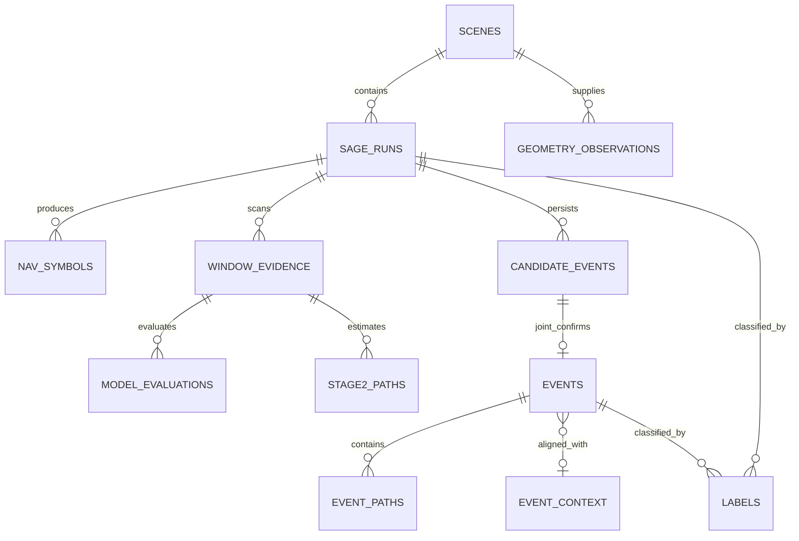

# GNSS SAGE Multipath Event Database 设计

## 1. 文档定位

本文定义 GNSS 多径 SAGE 项目下一阶段的统一事件数据库方案。目标是把每一次 `scene × PRN × tracking channel` 的 Stage0–Stage4 输出转换为可追溯、可批量追加、可按场景与传播条件统计的数据集。

本设计基于以下当前实际文件进行只读分析：

- `scenes/F1023_V70_D0117_P2/sage_results/reference_scene_final_validation_report.md`
- `scenes/F1023_V70_D0117_P2/sage_results/prn_validation_summary.csv`
- `scenes/F1023_V70_D0117_P2/sage_results/G06_nav_sage_v1/`
- `scenes/F1023_V70_D0117_P2/sage_results/nav_sage_v2/G11/`
- `scenes/F1023_V70_D0117_P2/sage_results/nav_sage_v2/G12/`
- `scenes/F1023_V70_D0117_P2/sage_results/nav_sage_v2/G25/`
- `scenes/F1023_V70_D0117_P2/sage_results/nav_sage_v2/G28/`
- `scenes/F1023_V70_D0117_P2/sage_results/nav_sage_v2/G29/`
- `scenes/F1023_V70_D0117_P2/sage_results/nav_sage_v2/G32/`
- `dataset/dataset_inventory.csv`
- reference scene 的 `metadata.json`、satellite geometry CSV 和通用 `run_context.json`

本文定义结构、派生规则与入库门禁。2026-08-25 已冻结 schema/enum/label/derivation v1，并对当前 57-task batch 与 reference 七 PRN 执行只读 dry-run validator；随后已将 QA 通过的 64 个 run 转换到新的版本化 event/path audit partition，完成 modeling-context alignment overlay，并完成 Stage4 confirmed path 的 bounded channel-parameter derivation 与独立 QA。全过程未运行 SAGE、未读取 raw IQ、未修改 pipeline、metadata、inventory 或任何已有 Stage 结果；statistical modeling 仍未开始。

## 2. 当前输出结构与设计约束

通用 SAGE 运行目录当前包含以下机器可读输出：

| Stage | 实际文件 | 数据粒度 |
|---|---|---|
| Run context | `run_context.json`, `run_context.mat` | 每次 scene-PRN 运行一条上下文 |
| Stage0 | `stage0_valid_symbols.csv` | 每个有效 NAV symbol 一行 |
| Stage0 | `stage0_valid_40ms_windows.csv` | 每个有效 40 ms window 一行 |
| Stage1 | `stage1_nav_fast_scan.csv` | 每个扫描 window 一行 |
| Stage2 | `stage2_model_orders.csv` | 每个候选 window × 每个模型阶数 L 一行 |
| Stage2 | `stage2_selected_windows.csv` | 每个进入 Stage2 的 window 一行，记录最终选中 L |
| Stage2 | `stage2_selected_paths.csv` | 每个 Stage2 选中模型的每条路径一行 |
| Stage3 | `stage3_persistence.csv` | 每个中心 window × 每条候选多径一行 |
| Stage3 | `stage3_reliable_centers.csv` | 每个可靠中心 window 一行 |
| Stage4 | `stage4_joint_summary.csv` | 每个进入 joint 100 ms 的中心 window 一行 |
| Stage4 | `stage4_joint_paths.csv` | 每个 Stage4 joint 结果的每条路径一行 |

MAT 文件和 checkpoint 仍是算法复现与诊断来源，不应被数据库替代。数据库是从现有结果生成的派生层，必须保留结果目录及源文件指纹。

当前存在两个必须兼容的结果命名空间：

- 历史基线：`sage_results/G06_nav_sage_v1/`。该目录没有通用运行所具备的完整 `run_context.json`，入库时需要 legacy adapter，且不得覆盖或补写源目录。
- 通用结果：`sage_results/nav_sage_v2/Gxx/`。目录内有 `run_context.json`，其 `contextVersion` 当前为 1。

现有 `prn_validation_summary.csv` 是较早的五 PRN 汇总，不包含 G29/G32。它可用于交叉核对，但不能作为七 PRN 或未来多 scene 数据库的唯一权威来源。权威源应为每个运行目录中的实际 Stage CSV/MAT 文件。

## 3. 数据库总体模型

推荐采用规范化的五层模型：

1. **场景与运行层**：保存 scene 元数据、输入来源、PRN/channel 映射、pipeline/参数版本和每阶段完成状态。
2. **窗口与模型证据层**：保存 Stage0/1 的逐窗口证据和 Stage2 的 L=1–4 模型评估。
3. **候选事件层**：保存 Stage3 持续性候选及其是否进入 Stage4。
4. **确认事件与路径层**：保存 Stage4 joint 事件及其 LOS/多径路径参数。
5. **上下文与标签层**：保存 elevation、azimuth、CN0、速度、environment、标签规则和人工审阅 provenance。



核心原则是：**运行、窗口、事件和路径不能混成一张表**。一个 confirmed event 可以包含多条路径；一个 Stage3 候选可能在 Stage4 被拒绝；一个 LOS reference run 可能没有任何事件行。将它们拆分后才能避免重复统计和错误标签。

## 4. 主键与版本标识

### 4.1 逻辑运行键

一个 SAGE 运行的逻辑键建议由以下字段组成：

```text
scene_id + prn + tracking_channel + experiment_namespace
```

其中：

- `scene_id`：例如 `F1023_V70_D0117_P2`。
- `prn`：保留标准字符串，例如 `G32`；另存 `constellation=G`、`prn_number=32`。
- `tracking_channel`：整数，例如 11。
- `experiment_namespace`：例如 `G06_nav_sage_v1` 或 `nav_sage_v2`，用于区分历史基线、pipeline 版本和未来重跑。

仅使用 `scene_id + prn` 不够，因为未来可能出现不同 channel、不同参数或不同版本的重复实验。

### 4.2 物理运行实例键

建议生成不可变 `run_id`，格式可为：

```text
<scene_id>__<prn>__ch<tracking_channel>__<experiment_namespace>__<ingestion_instance>
```

同时保存：

- `logical_run_key`
- `source_result_relpath`
- `source_fingerprint`
- `run_created_at_utc`
- `ingested_at_utc`
- `ingestion_version`

`source_fingerprint` 应由关键 CSV/MAT 文件的相对路径、大小和 SHA-256 组成。重复入库时，逻辑键和指纹均相同则跳过；逻辑键相同但指纹不同必须视为新版本或冲突，不能静默覆盖。

### 4.3 下级主键

- `symbol_id_global = run_id + symbol_id`
- `window_uid = run_id + window_id`
- `model_uid = window_uid + model_order`
- `stage2_path_uid = window_uid + path_id`
- `candidate_id = run_id + center_window_id`
- `event_id = run_id + center_window_id`
- `event_path_id = event_id + path_id`

CSV 中的 `window_id`、`center_window_id` 和 `path_id` 只在单次运行目录内有效，不能直接作为全库主键。

## 5. Scene-PRN 运行需要保存的核心字段

推荐 `sage_runs` 每个运行一行，字段分为以下几组。

### 5.1 身份与输入

| 字段 | 类型 | 来源/说明 |
|---|---|---|
| `run_id` | string | 数据库生成的不可变运行实例 ID |
| `logical_run_key` | string | scene、PRN、channel、namespace 组合 |
| `scene_id` | string | `run_context.json`、metadata、inventory 交叉核对 |
| `scene_role` | string | metadata/inventory，例如 `reference_scene`、`standard_scene` |
| `prn` | string | 标准化为 `Gxx` |
| `constellation` | string | 当前为 `G`；为以后其他星座保留 |
| `prn_number` | int16 | `G32` 对应 32 |
| `tracking_channel` | int16 | `run_context.json` 与 inventory 交叉核对 |
| `signal_type` | string | metadata/inventory，例如 `GPS_L1_CA` |
| `sampling_rate_hz` | int64 | `run_context.json`/metadata；当前支持数据包括 10.23 MHz，未来不得硬编码 |
| `raw_storage_mode` | string | inventory/metadata，例如 `scene_local`、`external_storage` |
| `raw_file_relpath` | string | 优先保存项目相对路径；外部文件保留规范化绝对路径和 storage mode |
| `tracking_file_relpath` | string | GNSS-SDR tracking MAT 来源 |
| `telemetry_file_relpath` | string | telemetry DAT 来源 |
| `rinex_nav_relpath` | string | RINEX NAV 来源 |
| `trajectory_relpath` | string | NMEA 来源 |
| `satellite_geometry_relpaths` | list/string | geometry summary/timeseries 来源列表 |

### 5.2 Pipeline、参数与 provenance

| 字段 | 类型 | 说明 |
|---|---|---|
| `pipeline_family` | string | 例如 `nav_sage_pipeline` |
| `pipeline_version` | string nullable | 当前目录名和报告称 Pipeline V3，但 `run_context.json` 没有独立 pipeline version 字段；不能凭空回填，需由未来 batch manifest 提供 |
| `experiment_namespace` | string | `G06_nav_sage_v1`、`nav_sage_v2` 或未来版本目录 |
| `context_version` | int nullable | 来自 `run_context.json`；legacy G06 可空 |
| `parameter_set_id` | string nullable | 指向参数快照；当前运行上下文没有完整参数快照时标记 `not_recorded` |
| `code_commit` | string nullable | Git commit；若执行时未记录则保持空值 |
| `code_sha256` | string nullable | pipeline 文件指纹；未来 batch manifest 推荐记录 |
| `run_created_at_utc` | timestamp nullable | `run_context.json.createdAtUtc`；legacy 结果若无可靠值不可用目录时间冒充 |
| `source_result_relpath` | string | 结果目录相对路径 |
| `source_fingerprint` | string | 关键输出文件内容指纹 |
| `ingestion_version` | string | 数据库转换器版本 |

### 5.3 完成状态与统计

| 字段 | 类型 | 来源 |
|---|---|---|
| `run_status` | enum | `complete`, `partial`, `failed`, `not_ingested` |
| `stage0_status` … `stage4_status` | enum | 根据文件存在性、可读性和 QA 规则确定，不只看目录存在 |
| `stage0_nav_symbol_count` | int | `stage0_valid_symbols.csv` 行数 |
| `stage0_window_count` | int | `stage0_valid_40ms_windows.csv` 行数 |
| `stage1_scanned_count` | int | `stage1_nav_fast_scan.csv` 行数 |
| `stage1_candidate_count` | int | 当前用 `stage2_selected_windows.csv` 行数表示进入 Stage2 的窗口数 |
| `stage2_L1_count` … `stage2_L4_count` | int | `stage2_selected_windows.selected_L` 分组计数 |
| `stage2_L_ge_2_count` | int | L2+L3+L4 |
| `stage2_L_ge_3_count` | int | L3+L4 |
| `stage3_reliable_event_count` | int | `stage3_reliable_centers.csv` 行数 |
| `stage4_joint_result_count` | int | `stage4_joint_summary.csv` 数据行数 |
| `confirmed_event_count` | int | 满足确认规则的事件数 |
| `confirmed_path_count` | int | confirmed event 中 `is_multipath=1` 的 Stage4 路径数 |
| `qa_status` | enum | `pass`, `warning`, `fail` |
| `qa_issue_count` | int | 与 `ingestion_issues` 表关联 |

这些运行级计数是摘要，不替代逐窗口、逐事件和逐路径表。

## 6. Stage0–Stage4 字段映射

### 6.1 Stage0：NAV symbol 和 40 ms window

`nav_symbols` 表直接保留 `stage0_valid_symbols.csv` 的实际字段：

- `symbol_id`, `telemetry_row`, `prn`, `tow_s`
- `sample_start_zero_based`, `recording_time_s`, `nav_symbol`
- `tracking_index`, `tracking_doppler_hz`, `code_frequency_hz`, `cn0_db_hz`
- `carrier_lock_test`, `tracking_tow_ms`
- `next_step_samples`, `next_tow_step_s`, `continuous_to_next`

另外添加 `run_id`、`symbol_id_global`、源文件和源行号。

`window_evidence` 的 Stage0 部分来自 `stage0_valid_40ms_windows.csv`：

- `window_id`, `symbol_index`, `sample_start_zero_based`
- `recording_time_s`, `tow_s`
- `nav_symbol_1`, `nav_symbol_2`, `split_samples`
- `tracking_doppler_hz`, `code_frequency_hz`, `cn0_db_hz`
- `vehicle_speed_kmh`, `speed_source`, `relative_doppler_bound_hz`

`vehicle_speed_kmh` 当前可能是 `NaN`，`speed_source` 可能为 `fallback_120_kmh`。数据库必须同时保存数值和来源，不能把 fallback 当作实测速度。

### 6.2 Stage1：fast scan 证据

将 `stage1_nav_fast_scan.csv` 按 `run_id + window_id` 左连接到 `window_evidence`。保留：

- `scan_valid`
- `main_delay_samples`, `main_doppler_hz`, `main_score`
- 三个 residual peak 的 delay、Doppler、power：`residual_peak1_*` 至 `residual_peak3_*`
- `has_one_strong_residual`, `has_two_strong_residuals`
- `screen_score_db`
- `error_message`

建议另加：

- `entered_stage2`：该 window 是否出现在 `stage2_selected_windows.csv`
- `stage1_rejection_reason`：由规则转换器生成；若没有明确原因则保持空值，不根据缺行猜测。

### 6.3 Stage2：模型评估、选中窗口和路径

`model_evaluations` 一行对应一个 `window × model_order`，直接映射 `stage2_model_orders.csv`：

- `window_id`, `recording_time_s`, `model_order`, `multipath_count`
- `rss`, `bic`, `bic_gain_from_previous`, `rss_gain_percent_from_previous`
- `model_valid`, `selected`
- `minimum_multipath_power_db`, `minimum_separation_samples`
- `maximum_relative_doppler_hz`, `maximum_coherence`

`window_evidence` 的 Stage2 摘要字段来自 `stage2_selected_windows.csv`：

- `selected_L`, `multipath_count`
- `selected_bic`, `selected_rss`
- `minimum_multipath_power_db`
- `maximum_relative_doppler_hz`
- `maximum_coherence`

`stage2_paths` 直接映射 `stage2_selected_paths.csv`：

- `path_id`, `is_multipath`, `selected_L`
- `delay_samples`, `excess_delay_samples`, `excess_delay_chips`
- `excess_path_length_m`
- `doppler_hz`, `doppler_offset_hz`
- `relative_power_db`

Stage2 路径是候选模型估计，不得与 Stage4 confirmed path 混为同一事实。应通过 `estimate_stage=stage2` 明确区分。

### 6.4 Stage3：持续性与可靠中心

`stage3_persistence_paths` 一行对应一个中心 window 的一条候选多径，映射 `stage3_persistence.csv`：

- `center_window_id`, `center_recording_time_s`, `selected_L`
- `multipath_id`
- `excess_delay_samples`, `doppler_offset_hz`, `relative_power_db`
- `matched_window_count`, `longest_consecutive_count`
- `persistence_pass`, `match_pattern`

`candidate_events` 一行对应 `stage3_reliable_centers.csv` 中一个可靠中心：

- `center_window_id`, `recording_time_s`
- `selected_L`, `multipath_count`
- `minimum_path_run`, `reliable_multipath`

数据库应从同一 `window_id` 的 Stage0 window 记录补回 `tow_s`、CN0、tracking Doppler 和速度。若找不到，写入 QA warning，不能用相邻行静默代替。

### 6.5 Stage4：joint event 和最终路径

`events` 表映射 `stage4_joint_summary.csv`：

- `center_window_id`, `recording_time_s`
- `stage2_L`, `joint_selected_L`, `joint_multipath_count`
- `joint_rss`, `joint_bic`, `snapshot_wins_vs_L1`
- `minimum_multipath_power_db`
- `maximum_relative_doppler_hz`
- `maximum_coherence`
- `joint_valid`

`event_paths` 表映射 `stage4_joint_paths.csv`：

- `path_id`, `is_multipath`, `joint_selected_L`
- `delay_samples`, `excess_delay_samples`, `excess_delay_chips`
- `doppler_hz`, `doppler_offset_hz`
- `mean_relative_power_db`

数据库中的 canonical path power 字段建议命名为 `relative_power_db`，同时保留 `source_power_field=mean_relative_power_db`，防止与 Stage2 的 `relative_power_db` 定义混淆。

## 7. 三类标签的表示方法

标签必须区分作用范围和来源。推荐字段：

- `label_scope`: `run` 或 `event`
- `label_value`: `confirmed_multipath`, `rejected_candidate`, `los_reference`
- `label_source`: `stage4_rule`, `reference_manifest`, `human_review`
- `label_rule_version`
- `label_created_at_utc`
- `review_status`: `algorithm_only`, `reviewed`, `external_truth`
- `label_notes`

### 7.1 confirmed multipath

事件级确认规则建议固定为：

```text
stage4_joint_summary.joint_valid == 1
AND stage4_joint_summary.joint_multipath_count > 0
AND count(stage4_joint_paths where is_multipath == 1) > 0
```

同时要求 summary 中 `joint_multipath_count` 与 path 表中 `is_multipath=1` 数量一致；不一致时标记 QA fail，而不是强行确认。

运行级 `confirmed_multipath` 表示该 run 至少含一个 confirmed event。reference scene 中 G06、G11、G12、G29、G32 属于此类。

### 7.2 rejected candidate

事件级 `rejected_candidate` 表示有 Stage3 可靠中心并具有明确 Stage4 拒绝证据，例如：

```text
joint_valid == 1 AND joint_multipath_count == 0
```

G28 的两个 Stage4 joint 结果均满足该条件，因此是明确的 rejected candidate。

如果 Stage3 中存在可靠中心，但 Stage4 文件缺失、运行中断或该中心未进入 Stage4，不能自动标成 rejected。应先使用操作状态：

- `not_joint_evaluated`
- `stage4_missing`
- `stage4_invalid`
- `unresolved_candidate`

只有出现明确的 rejection evidence 或经过人工审阅后，才写入 `rejected_candidate`。

### 7.3 LOS reference

`los_reference` 首先是**运行级/控制样本级标签**，不是从“没有 confirmed event”自动推导出的物理真值。推荐规则：

```text
reference_manifest explicitly marks run as LOS/low-multipath control
AND confirmed_event_count == 0
```

reference scene 的 G25 可由 reference manifest 标记为 `los_reference`。数据库还应保存：

- `is_reference_control=true`
- `reference_type=los_low_multipath`
- `label_source=reference_manifest`
- `review_status=algorithm_only` 或后续人工/外部真值状态

普通多 scene run 即使没有 Stage3/Stage4 事件，也只能先标为 `no_confirmed_event`，不能自动升级为 LOS reference。

## 8. 路径级参数与 coherence

每个 Stage4 event 可以包含一个 LOS 路径和零到多条 multipath 路径。`event_paths` 应保持一行一条路径，至少包含：

| 字段 | 说明 |
|---|---|
| `event_path_id` | 全局路径主键 |
| `event_id`, `run_id` | 外键 |
| `path_id` | 源 CSV 内路径编号 |
| `path_role` | `los` 或 `multipath`，由 `is_multipath` 映射 |
| `is_multipath` | 源字段 |
| `delay_samples` | 绝对 delay sample 参数 |
| `excess_delay_samples` | 相对 LOS excess delay |
| `excess_delay_chips` | 相对 LOS delay，chip 单位 |
| `doppler_hz` | 路径 Doppler |
| `doppler_offset_hz` | 相对 LOS 的有符号 Doppler offset |
| `relative_power_db` | Stage4 的 `mean_relative_power_db` |
| `estimate_stage` | 固定为 `stage4_joint` |
| `source_file`, `source_row_number` | 溯源字段 |

`maximum_coherence` 当前只存在于 `stage2_model_orders.csv`、`stage2_selected_windows.csv` 和 `stage4_joint_summary.csv`，是模型/事件级汇总值。当前 `stage4_joint_paths.csv` 没有每条路径独立 coherence。因此：

- canonical `event_paths` 不应伪造 `path_coherence`。
- `events.maximum_coherence` 保存实际 Stage4 事件级值。
- 面向分析的扁平 CSV 可以重复一列 `event_coherence` 到每条路径，但必须使用该名称，不能叫 `path_coherence`。
- 若未来 pipeline 增加路径级 coherence，应新增独立字段和 schema version，不能覆盖现有语义。

`excess_path_length_m` 当前出现在 Stage2 path 表，但 Stage4 path 表没有该列。默认应保持 Stage4 该字段为空。若后续由 delay 计算，必须另存 `derived_excess_path_length_m`、计算公式版本和使用的传播速度常数，不能冒充源字段。

## 9. Scene、PRN、channel、elevation 与 environment 关联

### 9.1 Scene 维表

`scenes` 每个 scene 一行，来源为 `metadata.json` 和 `dataset_inventory.csv`：

- `scene_id`, `scene_role`
- `signal_type`, `sampling_rate_hz`, `complex_iq`
- `raw_storage_mode`, `raw_path`
- GNSS-SDR/navigation/trajectory/satellite geometry 状态
- `inventory_warnings`
- metadata 与 inventory 的源路径和指纹

### 9.2 PRN/channel 映射

以 `dataset_inventory.csv.prn_tracking_channel_map` 为预检来源，以 `run_context.json.trackingChannel` 为运行事实来源。入库时必须比较两者：

- 唯一且一致：`channel_mapping_status=verified`
- inventory 中多 channel：`ambiguous`，需要 batch manifest 显式选择
- run_context 与 inventory 不一致：QA fail
- legacy G06：从已封存验证记录和实际 tracking/telemetry 文件核对，标记 `mapping_source=legacy_verified`

### 9.3 事件时间和 satellite geometry

Stage0 window 已有 `recording_time_s` 与 `tow_s`；Stage3/Stage4 只有 `recording_time_s`。satellite geometry timeseries 使用 `utc_time, prn, elevation_deg, azimuth_deg, snr_db_hz`。两者不能只凭 PRN 直接连接。

推荐增加 `time_alignment` 表：

| 字段 | 说明 |
|---|---|
| `scene_id` | 场景 |
| `alignment_id` | 时间对齐版本 |
| `recording_time_origin_utc` | recording_time=0 的 UTC 基准，若可验证 |
| `gps_week` | 用于 TOW→UTC；未知则为空 |
| `leap_seconds` | 使用值及来源 |
| `alignment_method` | `tow_to_utc`, `nmea_affine_fit`, `manual_anchor`, `unavailable` |
| `max_alignment_error_s` | 对齐残差上限 |
| `source_files` | NMEA/RINEX/Stage0 来源 |
| `verified` | 是否通过 QA |

事件上下文关联顺序：

1. 用 `run_id + center_window_id` 在 Stage0 window 中取得精确 `tow_s`、CN0、速度和 tracking Doppler。
2. 使用已验证的 `time_alignment` 将 event 映射到 UTC。
3. 按 `scene_id + prn` 筛选 geometry timeseries。
4. 在明确容差内进行 nearest 或 interpolation join。
5. 保存 `geometry_source_utc`、`geometry_time_delta_s`、`geometry_join_method` 和 `geometry_join_valid`。

若没有经过验证的时间锚点，`event_utc`、elevation 和 azimuth 必须为空，不能用 geometry summary 的均值冒充事件时刻值。summary 可以作为 run-level PRN context，且必须标记 `geometry_scope=run_summary`。

### 9.4 CN0/SNR 与速度

- `tracking_cn0_db_hz`：优先取事件中心 window 的 Stage0 `cn0_db_hz`。
- `nmea_snr_db_hz`：来自 satellite geometry timeseries，不能与 tracking CN0 合并成同一字段。
- `vehicle_speed_kmh`：取 Stage0 window，并保存 `speed_source`。
- fallback 速度只能作为算法 bound 的来源，不应被统计分析当作实测车辆速度。

### 9.5 Environment 信息

当前 reference scene `metadata.json` 和 inventory 没有明确的 `environment_class`、道路类型、遮挡类型或反射体真值字段。现有 scene ID 中的 `V70`、`D0117`、`P2` 在本次读取的数据库源文件里没有可验证的正式字段定义，因此设计上不得自动解释。

建议新增独立、人工维护或由采集清单导入的 `scene_context` 维表：

- `scene_id`
- `environment_class`：例如 open_sky、urban_canyon、suburban、tree_lined、tunnel 等受控枚举
- `road_type`
- `site_id`, `route_id`, `segment_id`
- `collection_date_utc`
- `nominal_speed_kmh` 与 `speed_semantics`
- `weather`, `surface_condition`, `traffic_level`
- `receiver_mount`, `antenna_type`
- `environment_source_file`
- `annotation_method`, `annotator`, `annotation_version`
- `environment_verified`

在正式采集语义文档建立前，上述字段保持 null。未来即使解析 scene ID，也必须把解析规则版本和原始 scene ID 一并保存。

## 10. 推荐数据库文件结构

推荐以 **Parquet 为主、CSV 为审计导出、JSON 为 schema/manifest**。原因是：

- Parquet 保留数值类型、布尔类型和 null，适合大量窗口和模型评估。
- CSV 便于人工核查 reference 基线和小批量结果，但不适合作为唯一主库。
- JSON 适合记录嵌套输入路径、文件指纹、参数快照和 schema version。

正式数据库 data directories 按以下结构规划；当前已在独立版本化 partition 中创建 CSV audit/fact tables、modeling-context alignment overlay 和 Stage4 path-parameter derivation tables；Parquet 主库及 statistical-model tables 仍未创建：

```text
dataset/
└── multipath_event_database/
    └── v1/
        ├── _schema/
        │   ├── schema.json
        │   ├── enums.json
        │   └── label_rules.json
        ├── dimensions/
        │   ├── scenes.parquet
        │   ├── scene_context.parquet
        │   ├── time_alignment.parquet
        │   └── geometry_observations.parquet
        ├── facts/
        │   ├── sage_runs.parquet
        │   ├── nav_symbols/
        │   ├── window_evidence/
        │   ├── model_evaluations/
        │   ├── stage2_paths/
        │   ├── stage3_persistence_paths/
        │   ├── candidate_events/
        │   ├── events/
        │   └── event_paths/
        ├── labels/
        │   ├── run_labels.parquet
        │   └── event_labels.parquet
        ├── manifests/
        │   ├── batch_runs/
        │   └── ingestions/
        ├── qa/
        │   ├── ingestion_issues.parquet
        │   └── validation_reports/
        └── exports/
            ├── run_summary.csv
            ├── events_flat.csv
            ├── confirmed_paths_flat.csv
            └── rejected_candidates.csv
```

大表建议按 `scene_id` 分区，必要时再按 `prn` 分区：

```text
facts/events/scene_id=F1023_V70_D0117_P2/prn=G32/part-....parquet
```

不要按 tracking channel 单独分区；channel 基数低且不同 scene 中语义不同，保留为普通列即可。

## 11. 建议的 canonical 表

| 表 | 粒度 | 主要用途 |
|---|---|---|
| `scenes` | 每 scene 一行 | 输入状态、信号类型、storage 和 scene provenance |
| `scene_context` | 每 scene/context version 一行 | environment 与采集条件 |
| `sage_runs` | 每 scene-PRN-run 一行 | 运行身份、版本、阶段统计和 QA |
| `nav_symbols` | 每有效 NAV symbol 一行 | Stage0 审计与 NAV 连续性分析 |
| `window_evidence` | 每 40 ms window 一行 | Stage0+Stage1+Stage2 选中摘要与上下文 |
| `model_evaluations` | 每 window-L 一行 | L1–L4 模型选择分析 |
| `stage2_paths` | 每 Stage2 路径一行 | 候选路径估计，不代表 confirmed |
| `stage3_persistence_paths` | 每中心-window候选路径一行 | 持续性证据 |
| `candidate_events` | 每 Stage3 reliable center 一行 | 进入或等待 Stage4 的候选事件 |
| `events` | 每 Stage4 joint result 一行 | confirmed/rejected 的事件事实 |
| `event_paths` | 每 Stage4 路径一行 | LOS 与多径路径参数 |
| `event_context` | 每 event 一行 | UTC、geometry、CN0、速度和 join 质量 |
| `labels` | 每标签版本一行 | 算法标签、reference 标签、人工/外部真值 |
| `ingestion_issues` | 每 QA 问题一行 | 阻断或警告信息 |

`events_flat.csv` 和 `confirmed_paths_flat.csv` 只是方便分析的派生视图。所有重复字段应能追溯回上述规范化表。

## 12. Batch SAGE 后自动入库流程

数据库生成器应是 pipeline 外部的独立转换层，不改动 `run_nav_sage_pipeline.m`。推荐流程如下。

### Step 1：batch preflight

从 `dataset_inventory.csv` 生成待运行清单，逐项检查：

- scene metadata 和输入状态完整；
- PRN/channel 映射唯一；
- raw、tracking、telemetry、RINEX NAV、trajectory、geometry 文件存在；
- sampling rate 受当前 pipeline 支持；
- 输出目录不存在；
- inventory warning 已处理或显式豁免。

输出不可变 batch manifest，记录每个 planned run、输入路径、pipeline 文件指纹、参数集和目标目录。

### Step 2：运行 SAGE

按 manifest 调用现有 pipeline，保持 Stage0–Stage4 输出格式不变。中断时保留 checkpoint。运行器只更新 batch manifest 中的运行状态，不修改 scene metadata/inventory。

### Step 3：完成性检查

完成 MATLAB 后验证：

- 进程正常退出；
- `run_context.json` 存在且 scene/PRN/channel 与 manifest 一致；
- 所需 Stage CSV/MAT 可读；
- 空结果使用“仅表头 CSV”表示时可以识别，例如 G25 的 Stage4；
- partial run 不进入 final fact 表，只进入 ingestion manifest/QA。

### Step 4：staging ingestion

读取实际 CSV header，不按文件名猜字段。将每张表转换为 typed staging table，并添加：

- `run_id`
- `source_file`
- `source_row_number`
- `source_file_sha256`
- `schema_version`
- `ingested_at_utc`

未知列应保留并报告 schema drift；缺少必需列则 QA fail。

### Step 5：规范化与关联

依次构建：

1. `sage_runs`
2. `nav_symbols` 和 `window_evidence`
3. `model_evaluations`、`stage2_paths`
4. `stage3_persistence_paths`、`candidate_events`
5. `events`、`event_paths`
6. `event_context`
7. `labels`

连接必须使用 `run_id + window_id/center_window_id/path_id`，不能只用 window ID。

### Step 6：标签生成

使用版本化规则生成 algorithm labels：

- Stage4 valid 且 MP count/path 一致且大于 0 → `confirmed_multipath`
- Stage4 valid 且 MP count 为 0 → `rejected_candidate`
- LOS reference 仅从 reference manifest 或人工审阅导入

标签规则文件写入 `_schema/label_rules.json`，规则变更时生成新版本，不就地覆盖历史标签。

### Step 7：QA 与原子提交

所有约束通过后，先写临时 partition，再原子登记到 ingestion manifest。不得逐行直接追加到单个共享 CSV。失败时保留 QA 报告，不产生半完成 final partition。

### Step 8：生成审计导出

从 canonical Parquet 生成：

- scene-PRN run summary
- confirmed event/path CSV
- rejected candidate CSV
- LOS reference/control CSV
- batch QA report

reference scene 七 PRN 应作为首个 regression fixture。

## 13. 必须执行的 QA 规则

### 13.1 运行与输入一致性

- `run_context.sceneId == metadata.scene_id == inventory.scene_id`
- `run_context.prnLabel` 与目录 PRN 一致
- `run_context.trackingChannel` 在 inventory 中对该 PRN 唯一且一致
- `samplingRateHz` 与 metadata/inventory 一致
- source path 指向预期 scene，不能跨 scene 误连

### 13.2 Stage 计数一致性

- Stage0 window 行数应与 Stage1 扫描行数一致；不一致时至少 warning，并检查 `scan_valid/error_message`
- 每个 Stage2 candidate 应有 L=1、2、3、4 四行 model evaluation；reference 数据预期 `model_rows = candidate_count × 4`
- 每个 candidate window 恰有一个 `selected=1`，且与 `stage2_selected_windows.selected_L` 一致
- Stage2 path 数量应与选中模型阶数的路径行数一致
- `stage3_reliable_centers` 必须能关联 Stage0/Stage2 window
- Stage4 center 必须能关联 Stage3 reliable center；若算法未来允许例外，必须由 schema version 明确记录
- 每个 Stage4 event 的 path 行数应等于 `joint_selected_L`
- `joint_multipath_count` 应等于 Stage4 paths 中 `is_multipath=1` 的数量
- confirmed event 必须同时通过 summary 和 path 两侧条件

### 13.3 空表和 partial run

- 仅有表头的 CSV 是合法空结果，不是解析失败。
- 文件缺失、CSV 损坏、MAT checkpoint 存在但 final CSV 不完整时，run 标记 `partial`。
- partial run 不得被标为 LOS 或 rejected candidate。
- G06 legacy adapter 缺少 `run_context.json` 时必须明确记录 `context_missing_legacy=true`，不能生成伪造时间戳。

### 13.4 数值与单位

- delay 必须区分 samples、chips 和派生 meters。
- Doppler offset 保留正负号；event 的 maximum relative Doppler 通常是幅值，不能替代 path 的 signed offset。
- Stage2 `relative_power_db` 与 Stage4 `mean_relative_power_db` 保留来源字段名。
- `NaN` 转为数据库 null，并保留相应 source/method 字段。
- CN0 与 NMEA SNR 分列。

## 14. Reference scene 回归基线

首个数据库转换器完成后，必须用七 PRN 封存结果进行回归测试，期望运行级摘要为：

| PRN | Ch. | Stage1 candidates | L>=2 | L>=3 | Stage3 | Stage4 | Confirmed events | Confirmed paths | 期望分类 |
|---|---:|---:|---:|---:|---:|---:|---:|---:|---|
| G06 | 4 | 95 | 87 | 58 | 2 | 2 | 2 | 4 | `confirmed_multipath` |
| G11 | 5 | 101 | 56 | 52 | 7 | 7 | 1 | 1 | `confirmed_multipath` |
| G12 | 6 | 96 | 58 | 46 | 4 | 4 | 2 | 2 | `confirmed_multipath` |
| G25 | 0 | 52 | 12 | 10 | 0 | 0 | 0 | 0 | `los_reference`，由 reference manifest 指定 |
| G28 | 1 | 54 | 12 | 8 | 2 | 2 | 0 | 0 | `rejected_candidate` |
| G29 | 7 | 77 | 32 | 26 | 1 | 1 | 1 | 1 | `confirmed_multipath` |
| G32 | 11 | 117 | 86 | 71 | 11 | 8 | 2 | 3 | `confirmed_multipath` |

总计应得到 8 个 confirmed event 和 11 条 confirmed multipath path。该数字仅用于转换器回归，不代表多 scene 统计结论。

## 15. 建议的实现边界

未来实现建议新增独立目录，例如：

```text
scripts/event_database/
    build_scene_dimension.py
    validate_sage_run.py
    ingest_sage_run.py
    build_event_context.py
    export_event_views.py
```

其中 `scripts/event_database/validate_sage_database_dry_run.py` 已作为只读门禁 validator 实现；其余转换器仍为后续建议。实现时必须遵守：

- 不修改 `run_nav_sage_pipeline.m` 以适配数据库；转换器读取现有输出。
- 不向已有 `nav_sage_v2/Gxx` 或 `G06_nav_sage_v1` 目录写入任何数据库辅助文件。
- 数据库只写入新的版本化 dataset 目录。
- 所有转换可重复执行且具备幂等性。
- schema、label rules 和 ingestion manifest 必须版本化。
- 首先完成 reference scene dry-run 转换和逐表核对，再处理多 scene 小批量。

## 16. 推荐实施顺序

1. **Completed (2026-08-25)：** 冻结 schema v1、枚举、label rule v1 和 derivation manifest v1。
2. **Completed (2026-08-25)：** 只读 validator 已验证当前 57-task batch，不生成数据库。
3. **Completed (2026-08-25)：** reference-scene dry-run 已完成，只输出 validator QA/预览证据。
4. **Completed (2026-08-25)：** 七 PRN 回归矩阵复现为 8 confirmed events / 11 confirmed multipath paths。
5. **Completed with QA (2026-08-25)：** 生成版本化 event/path audit partition 和 ingestion manifest；G06 legacy 保留审计但排除建模输入。
6. **Completed with QA (2026-08-25)：** 使用固定 18 秒 GPS–UTC 偏移、RINEX/NMEA 日历锚点和同 PRN nearest-GSV 规则完成 13/13 scene 的时间对齐；导入既有 13/13 人工 scene context。
7. 设计 batch SAGE dry-run manifest，与数据库 run schema 使用同一逻辑运行键。
8. 选少量 standard scene 做端到端小批量测试。
9. **Completed with QA (2026-08-25)：** 在显式授权后完成 Stage4 confirmed path 的 bounded channel-parameter derivation；统计模型仍需单独门禁。

## Current Status

reference scene 七 PRN Stage0–Stage4 验证已经完成并封存。当前 schema/enum/label/derivation v1 已冻结，且已创建只读 validator、dry-run 证据、版本化 event/path audit partition 和 modeling-context alignment overlay；64 个 run、308 个 Stage4 event、412 条 Stage4 path 已完成独立 QA。当前 alignment 已验证 13/13 scene、284/308 event geometry rows，环境建模入口保留 100 条 confirmed paths，仰角建模入口保留 84 条 confirmed paths；G06 和无法可靠对齐的记录保留审计但不进入相应建模入口。

channel-parameter derivation v1 已完成独立 QA；下一项门禁任务是显式授权后的统计建模。当前未对任何现有 SAGE 结果执行迁移。

## 17. 2026-08-25 modeling-context alignment

新增版本化 overlay：`dataset/multipath_event_database/v1/partitions/alignment_id=alignment_20260825_tow_geometry_scene_v1/`。

- 时间规则：RINEX 首条导航记录日期与 NMEA active RMC 日期一致；GPS week 由该 UTC 锚点确定；GPS–UTC 固定使用冻结 pipeline 的 18 s；事件只使用 Stage0 `tow_s` 转换 UTC。
- 几何规则：同 scene、同 PRN、nearest GSV，最大时间差 5 s；不插值、不使用 scene/PRN 均值替代 event geometry。
- 结果：64 runs、13/13 time alignment、308 event contexts、284 geometry-valid event contexts、100 environment-ready confirmed paths、84 elevation-ready confirmed paths。
- G06 legacy `run_context.json` 缺失：2 个事件和 4 条 confirmed paths 保留审计，排除建模；另外 10 个 PRN-missing event rows 和 12 个超出 5 s 的 event rows 保留并排除 elevation-conditioned modeling。
- 独立 QA：`dataset_generation_logs/multipath_event_modeling_alignment_qa_20260825/qa_report.md`，结果 `PASS`。
- 本次未读取 raw IQ、未启动 MATLAB/SAGE/batch、未修改原始 SAGE artifact、production manifest、request、inventory 或 pipeline；channel-parameter derivation 已完成，statistical model 仍未开始。

## 18. 2026-08-25 Stage4 path-parameter derivation

新增版本化参数分区：`dataset/multipath_event_database/v1/partitions/parameter_set_id=parameters_20260825_stage4_path_v1/`。

- 输入仅为 QA 通过的 alignment overlay 中的 `confirmed_paths_environment_ready.csv` 和 `confirmed_paths_elevation_ready.csv`；每一行均保持 `estimate_stage=stage4_joint`、`is_multipath=1`、`label_value=confirmed_multipath`。
- 派生规则：`excess_delay_s = excess_delay_samples / 10230000`；`excess_path_length_m = excess_delay_s × 299792458`；有符号 `relative_doppler_hz` 取 Stage4 `doppler_offset_hz`；relative power 保留 Stage4 `mean_relative_power_db` 来源。
- 结果：100 条 environment-ready confirmed paths、94 个 confirmed events、84 条 elevation-ready paths；生成逐路径参数、逐事件描述性参数，以及 4 个环境组和 3 个仰角组的 median/min/max 摘要。
- 16 条缺少可靠事件级仰角的 path 仍保留在环境参数表，但明确排除 elevation summary；未用 scene mean、插值或文件名推断仰角。
- RMS delay spread、Doppler spread、Ricean K-factor、path lifetime 和 fitted distribution family 在本版本保持 `NOT_DERIVED`，没有把不完整字段提升为统计模型。
- 独立 QA：`dataset_generation_logs/multipath_event_channel_parameter_qa_20260825/qa_report.md`，结果 `PASS`。
- 本次未读取 raw IQ、未启动 MATLAB/SAGE/batch，未修改原始 SAGE artifact、alignment/source partition、production manifest、request、inventory 或 pipeline；statistical modeling 仍未开始。
