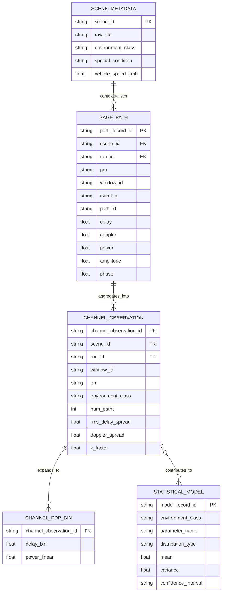

# GNSS Multipath Statistical Channel Modeling Database Schema

## 1. 文档定位

本文档是面向论文数据生产和后续统计建模的数据库 schema 设计。它只定义逻辑表、字段、粒度、来源、计算关系和 provenance，不创建真实数据库、不迁移已有 SAGE 结果，也不表示任何数据库表已经完成填充。

当前论文主线为：

```text
raw GNSS IQ
  -> GNSS-SDR tracking/navigation support
  -> SAGE multipath path extraction
  -> path-level parameters
  -> channel parameters
  -> environment-conditioned statistical GNSS multipath channel model
```

本设计与既有的详细事件库设计 `docs/MULTIPATH_EVENT_DATABASE_DESIGN.md` 互补：本文面向论文的四层抽象；实际实现时必须继续保留 run、window、candidate event、confirmed event、path 和 ingestion QA 等规范化事实表，不能把不同粒度压缩成一张表。

## 2. 设计原则

1. `scene_id` 是四层之间的主要关联键，表示观测场景和环境上下文的来源。
2. 下层表不能只使用 `scene_id` 作为物理主键。重复运行、不同 PRN、不同 window、不同 pipeline namespace 必须使用组合键或不可变 `run_id` 区分。
3. 一行 path 表示一条 SAGE 估计传播路径；一行 channel observation 表示一个 scene-PRN-window 的信道观测；一行 statistical model 表示一个环境/条件/参数的模型记录。
4. SAGE 源字段、派生计算字段和论文统计字段必须分开命名并保留来源。
5. 缺失值使用数据库 null，并保存缺失原因；不得用零代替未知 delay、Doppler、power、phase、elevation 或模型参数。
6. Stage2/Stage3 候选路径不能自动当作 confirmed multipath。confirmed 标签必须来自版本化 Stage4 规则。
7. 统计模型只有在 path/channel 数据完成、QA 通过并记录样本覆盖后才能生成；当前不声称模型或数据库已完成。

## 3. 四层关系图



逻辑关系为：

```text
scene
  -> path
  -> channel parameter
  -> statistical model
```

`scene_id` 在所有层中作为外键保留。`run_id`、`window_id`、`event_id` 和 `path_id` 用于在同一 scene 内区分运行、卫星、时间窗口、事件和路径。

## 4. Layer 1 — Scene Metadata Table

### 4.1 粒度与状态

- 粒度：一行一个唯一 `scene_id`，必要时按 `metadata_version` 保留人工修订版本。
- 当前来源：`dataset_generation_logs/production_planning_10mhz_20260812/scene_metadata_10MHz.csv`。
- 当前状态：scene metadata layer 已建立；本 schema 不重新创建或复制该表。
- 20.46 MHz、未纳入当前 10.23 MHz production 范围的 scene 不应被本层自动纳入。

### 4.2 推荐字段

| 字段 | 类型 | 语义 | 来源/状态 |
|---|---|---|---|
| `scene_id` | string | 场景唯一标识 | metadata CSV / inventory |
| `raw_file` | string | raw 文件名 | metadata CSV |
| `raw_file_path` | string | raw 文件路径或规范化相对路径 | metadata CSV / scene metadata |
| `raw_storage_mode` | enum | `scene_local` 或 `external_storage` 等 | scene metadata |
| `raw_file_size_bytes` | int64 nullable | 文件属性记录 | annotation/inventory；不表示 raw 内容已重新读取 |
| `sample_rate_hz` | int64 | 采样率 | scene metadata / inventory |
| `signal_type` | string | 例如 GPS L1 C/A | scene metadata |
| `scene_role` | string nullable | reference/standard 等角色 | scene metadata/inventory |
| `environment_class` | string | 人工环境类别 | 人工确认 metadata |
| `special_condition` | string nullable | 特殊条件或主要反射体描述 | 人工确认 metadata |
| `road_type` | string nullable | 道路类别 | 人工确认 metadata |
| `vehicle_speed_kmh` | float nullable | 人工确认的车速 | `human_measurement_description` |
| `speed_source` | string nullable | 速度来源语义 | 人工 metadata |
| `human_description` | string nullable | 人工采集描述 | 人工确认 metadata |
| `prn_list` | list/string nullable | scene 中可用 PRN | inventory |
| `number_of_prn_tasks` | int nullable | scene-PRN 任务数量 | inventory |
| `gnss_sdr_status` | enum | GNSS-SDR provenance 状态 | scene metadata/inventory |
| `navigation_status` | enum | RINEX NAV/OBS 准备状态 | scene metadata/inventory |
| `trajectory_status` | enum | NMEA trajectory 状态 | scene metadata/inventory |
| `satellite_geometry_status` | enum | geometry 生成状态 | scene metadata/inventory |
| `metadata_source_file` | string | metadata layer 来源文件 | ingestion provenance |
| `metadata_source_sha256` | string nullable | 来源文件 hash | ingest manifest |
| `metadata_version` | string | metadata schema/annotation 版本 | schema manifest |

环境字段必须来自人工采集记录或明确的 metadata source，不能由 SAGE 结果反推。`vehicle_speed_kmh` 也必须保留来源，不能将算法 fallback 或 scene 名称解析结果伪装成人工测量。

## 5. Layer 2 — SAGE Path Database

### 5.1 粒度与范围

- 粒度：一行一条传播路径。
- 典型来源：Stage4 `stage4_joint_paths.csv` 的最终 joint path；Stage2 path 可另存为 candidate estimate，但不得与 Stage4 canonical path 混用。
- 每条记录必须携带 `estimate_stage`、`source_file`、`source_row_number` 和 `source_hash`。
- 同一个 `window_id` 可以有多个 path；同一个 scene 可以有多个 PRN、多个运行和多个事件。

### 5.2 推荐字段

#### 身份与关联字段

| 字段 | 类型 | 说明 |
|---|---|---|
| `path_record_id` | string PK | 数据库生成的不可变路径记录 ID |
| `scene_id` | string FK | Layer 1 主关联键 |
| `run_id` | string FK | scene-PRN-channel-namespace 运行实例 |
| `prn` | string | 卫星标识 |
| `tracking_channel` | int nullable | 实际跟踪通道 |
| `window_id` | string | 源运行内的时间窗口 ID |
| `event_id` | string nullable | Stage3/Stage4 事件关联；非事件候选可为空 |
| `path_id` | string/int | 源结果中的路径编号 |
| `estimate_stage` | enum | `stage2_candidate`、`stage3_persistent`、`stage4_joint` |
| `path_role` | enum nullable | `los`、`multipath`、`candidate` |
| `is_multipath` | boolean nullable | 源 Stage4 或版本化标签字段 |

#### Path-level parameters

| 字段 | 类型 | 说明 | 来源 |
|---|---|---|---|
| `delay_samples` | float nullable | 源 delay，sample 单位 | SAGE output |
| `excess_delay_samples` | float nullable | 相对 LOS 的 excess delay | SAGE output或受控派生 |
| `delay_chips` | float nullable | chip 单位 delay | SAGE output或受控派生 |
| `excess_delay_s` | float nullable | 秒单位 excess delay | 派生，需记录公式/采样率 |
| `doppler_hz` | float nullable | 路径 Doppler | SAGE output |
| `doppler_offset_hz` | float nullable | 相对 LOS 的 Doppler offset | SAGE output或受控派生 |
| `power_db` | float nullable | 源路径功率字段 | SAGE output |
| `relative_power_db` | float nullable | 相对功率 | SAGE output或受控派生 |
| `amplitude` | float nullable | 路径幅度 | SAGE output（若存在） |
| `phase_rad` | float nullable | 路径相位，弧度 | SAGE output（若存在） |
| `coherence` | float nullable | 路径级 coherence；若源文件没有则保持 null | SAGE output（若存在） |

不要把事件级 `maximum_coherence` 复制后命名为路径级 `coherence`。如果只有事件级 coherence，应使用 `event_maximum_coherence` 单独保存。

#### Provenance 与标签

| 字段 | 类型 | 说明 |
|---|---|---|
| `source_result_relpath` | string | 源 SAGE 结果相对路径 |
| `source_file` | string | 源 CSV/MAT 文件 |
| `source_row_number` | int nullable | 源行号 |
| `source_file_sha256` | string nullable | 源文件 hash |
| `label_value` | enum nullable | `confirmed_multipath`、`rejected_candidate`、`los_reference` 或 `no_confirmed_event` |
| `label_rule_version` | string nullable | 标签规则版本 |
| `label_source` | enum nullable | `stage4_rule`、`reference_manifest`、`human_review` |
| `missing_reason` | string nullable | 参数缺失原因 |
| `schema_version` | string | path schema 版本 |

### 5.3 标签边界

- `confirmed_multipath` 必须满足当前 Stage4 confirmed criterion：`joint_valid=1`、`joint_multipath_count>0` 且 path 表存在 `is_multipath=1`。
- `rejected_candidate` 只能表示有明确 Stage4 拒绝证据的候选；缺失 Stage4 或 partial run 不得自动标为 rejected。
- `los_reference` 必须来自 reference/control manifest 或人工审阅；没有 confirmed event 不等于 LOS 真值。
- 未被 selector 晋级的窗口只能保留 `not_promoted`/`no_confirmed_event` 等覆盖状态，不能当作物理 LOS 样本。

## 6. Layer 3 — Channel Parameter Database

### 6.1 粒度与关系

- 粒度：一行一个 `scene_id × run_id × PRN × window_id` channel observation。
- 它由 Layer 2 的 path rows 派生，不直接替代 path database。
- `environment_class`、`special_condition`、`road_type` 和 `vehicle_speed_kmh` 通过 `scene_id` 从 Layer 1 关联；卫星仰角和 CN0 必须通过经过 QA 的时间/窗口关联得到。

### 6.2 推荐字段

| 字段 | 类型 | 语义 | 来源 |
|---|---|---|---|
| `channel_observation_id` | string PK | channel observation 唯一 ID | 数据库生成 |
| `scene_id` | string FK | Layer 1 关联键 | Layer 1 |
| `run_id` | string FK | 运行实例 | SAGE run provenance |
| `window_id` | string | 观测窗口 | Stage0/Stage4 |
| `event_id` | string nullable | 若窗口被 event 关联则保存 | Stage3/Stage4 |
| `PRN` | string | 卫星标识 | run context/SAGE output |
| `tracking_channel` | int nullable | channel | run context |
| `recording_time_s` | float nullable | 窗口时间 | Stage0/SAGE output |
| `tow_s` | float nullable | TOW | Stage0 |
| `elevation_deg` | float nullable | 事件/窗口时刻 elevation | verified geometry join |
| `azimuth_deg` | float nullable | 事件/窗口时刻 azimuth | verified geometry join |
| `geometry_join_status` | enum | valid/invalid/unavailable/inconclusive | geometry QA |
| `cn0_db_hz` | float nullable | tracking CN0 | Stage0/tracking |
| `nmea_snr_db_hz` | float nullable | NMEA geometry SNR | geometry |
| `environment_class` | string | 环境类别 | Layer 1 |
| `special_condition` | string nullable | 特殊反射/天气等 | Layer 1 |
| `road_type` | string nullable | 道路类型 | Layer 1 |
| `vehicle_speed_kmh` | float nullable | 人工速度字段 | Layer 1 |
| `num_paths` | int nullable | 该窗口的路径数 | 由 Layer 2 计算 |
| `num_multipath_paths` | int nullable | multipath path 数 | 由 Layer 2/标签计算 |
| `pdp_reference` | string/JSON nullable | PDP 记录或外部 PDP 表引用 | 由 path 计算 |
| `mean_excess_delay_s` | float nullable | 平均 excess delay | 由 path 计算 |
| `rms_delay_spread_s` | float nullable | RMS delay spread | 由 path 计算 |
| `doppler_mean_hz` | float nullable | 路径 Doppler 的统计量 | 由 path 计算 |
| `doppler_spread_hz` | float nullable | Doppler spread | 由 path 计算 |
| `k_factor_db` | float nullable | Ricean K-factor | 由 LOS/散射功率计算 |
| `path_power_statistics` | JSON nullable | 路径功率的候选统计量，如分位数、范围或离散度 | 由 path 计算；optional candidate |
| `path_lifetime_s` | float nullable | 路径持续时间/寿命 | 由跨窗口 path association 计算；optional candidate |
| `path_temporal_stability` | float/JSON nullable | 路径参数跨窗口稳定性摘要 | 由跨窗口 path association 计算；optional candidate |
| `observation_quality` | enum | valid/warning/inconclusive/invalid | channel QA |
| `derivation_version` | string | 派生公式版本 | schema/provenance |

### 6.3 PDP 表示

`PDP` 不建议只保存为不可查询的字符串。推荐：

- `channel_observations` 保存 `pdp_id` 和摘要字段；
- 独立 `channel_pdp_bins` 表一行一个 delay bin，字段为 `channel_observation_id`、`delay_bin_s`、`power_linear`、`power_db`、`normalization_rule`；
- 如使用 Parquet nested list，仍需保存等价 schema 和 bin 单位。

PDP 的输入是 path delay 与线性功率；具体 LOS 去除、bin width、归一化和功率阈值必须在 `derivation_manifest` 中冻结，不得从结果图反推。

### 6.4 Channel parameter 计算定义

- `num_paths`：符合指定 path inclusion rule 的 path 数。
- `mean_excess_delay`：按功率加权或未加权的选择必须显式记录。
- `RMS_delay_spread`：由 excess delay 与功率权重计算，保存单位和公式版本。
- `doppler_mean`：必须说明使用 signed Doppler 还是相对 Doppler。
- `doppler_spread`：必须固定统计定义，例如二阶中心矩或指定分位宽度。
- `K_factor`：需要明确 LOS path 定义、线性功率转换和无 LOS 时的 null/inconclusive 语义。

这些字段目前是未来计算字段，不是已有数据字段。

### 6.5 Candidate parameter pool

当前 Layer 3 采用候选参数池，而不是已经冻结的最终模型参数集合。

**Mandatory candidates for initial channel observations:**

- `PDP`
- `num_paths`
- `mean_excess_delay`
- `RMS_delay_spread`
- `Doppler_spread`
- `K_factor`

**Optional candidates for later evaluation:**

- `path_power_statistics`
- `path_lifetime`
- `path_temporal_stability`

`path_power_statistics` 可以保存路径功率的均值、范围、分位数、离散度或其他在 derivation manifest 中明确的摘要；`path_lifetime`/`path_temporal_stability` 需要跨相邻窗口进行可靠的 path association，不能由单窗口 SAGE 输出直接伪造。Parameter selection is not finalized. Final statistical model parameters will be selected after multi-scene production data analysis, physical-interpretability review and statistical-stability evaluation. 因此当前 schema 不填入参数值，也不声称所有候选参数都已验证或都会进入最终模型。

## 7. Layer 4 — Statistical Model Database

### 7.1 粒度

- 粒度：一个环境条件、一个 channel parameter、一个统计模型版本一行或一组参数行。
- 它依赖 Layer 3 的 coverage-complete observations。
- 当前只设计 schema，不填入 mean、variance、confidence interval 或任何分布数字。

### 7.2 推荐字段

| 字段 | 类型 | 说明 |
|---|---|---|
| `model_record_id` | string PK | 模型记录 ID |
| `model_version` | string | 统计模型版本 |
| `environment_class` | string | 环境类别 |
| `special_condition` | string nullable | 可选条件分层 |
| `road_type` | string nullable | 道路分层 |
| `elevation_bin` | enum nullable | `LOW`、`MID`、`HIGH`；需定义边界版本 |
| `speed_bin` | string nullable | 速度条件分层 |
| `parameter_name` | enum | `delay_spread`、`doppler_spread`、`k_factor`、`path_number` 等 |
| `parameter_unit` | string | 物理单位 |
| `distribution_type` | string | 拟合分布类型 |
| `mean` | float nullable | 模型均值 |
| `variance` | float nullable | 模型方差 |
| `confidence_interval` | JSON/string nullable | 置信区间及方法 |
| `quantiles` | JSON/string nullable | 可选分位数参数 |
| `sample_count` | int nullable | 用于拟合的 observation 数 |
| `scene_count` | int nullable | 覆盖的 scene 数 |
| `fit_method` | string nullable | 拟合方法 |
| `selection_criterion` | string nullable | 模型选择依据 |
| `training_filter` | JSON/string nullable | 纳入/排除规则 |
| `validation_summary` | JSON/string nullable | 留出或跨 scene 验证摘要 |
| `source_channel_schema_version` | string | Layer 3 schema 版本 |
| `created_at_utc` | timestamp | 模型生成时间 |
| `provenance_manifest_sha256` | string | 输入数据/规则 manifest hash |
| `model_status` | enum | draft/validated/frozen |

### 7.3 必须覆盖的模型族

- delay spread model；
- Doppler spread model；
- K-factor model；
- path number model。

模型可以按环境类别、特殊条件、道路类型、LOW/MID/HIGH elevation 和速度条件进一步分层，但只有样本覆盖足够且分层规则预先定义时才能建立子模型。

## 8. 字段来源分类

### 8.1 直接来自现有 SAGE/scene 输出

- scene identity、PRN、tracking channel、window/event/path identity；
- Stage4 path 的 delay、Doppler、relative power、`is_multipath`；
- Stage0 的 TOW、recording time、NAV symbol、CN0 和 tracking fields；
- run context、pipeline namespace、source file 和 hash；
- geometry timeseries 中实际存在且经过时间对齐的 elevation/azimuth/SNR。

### 8.2 需要计算或关联

- `run_id`、path record ID、channel observation ID、model record ID；
- excess delay 的统一单位转换；
- PDP、mean excess delay、RMS delay spread、Doppler mean/spread、K-factor；
- `num_paths`、`num_multipath_paths`；
- event/window 与 geometry 的时间对齐；
- environment/elevation/speed 分层索引；
- statistical distribution、mean、variance、confidence interval。

### 8.3 主要用于论文统计

- 每 scene/PRN/environment/elevation bin 的 multipath occurrence rate；
- path number 分布；
- excess delay 和 RMS delay spread 分布；
- Doppler shift/spread 分布；
- PDP 与 K-factor 分布；
- 不同环境和速度条件之间的比较；
- 模型拟合和跨 scene 验证指标。

论文统计字段必须能回溯到 path/channel observation 原始行，不能只保存最终图表或汇总数字。

## 9. Provenance、版本和 QA

每层都应至少带有：

- `schema_version`；
- `source_file` / `source_file_sha256`；
- `run_id` 或上游 record ID；
- `created_at_utc`；
- `derivation_version` 或 `label_rule_version`；
- 缺失值/不确定性原因；
- `gold_labels_used_for_selection`（若未来接入 sampling 相关产物，production selector 与 posterior replay 必须分离）。

建议使用 Parquet 保存大表、CSV 生成审计导出、JSON 保存 schema/enum/derivation manifest。未来数据库目录应使用独立版本化 namespace，不写入 `scenes/**/sage_results`，不覆盖 reference 或任何既有 artifact。

最低 QA 规则：

1. `scene_id` 在四层关联中必须可追溯。
2. `run_id + PRN + channel + window_id + path_id` 不能产生歧义重复。
3. Stage4 confirmed event 必须同时通过 summary、multipath count 和 path 表条件。
4. Stage2/Stage3 候选不能自动升级为 confirmed。
5. geometry 无法可靠对齐时，elevation/azimuth 保持 null 并记录原因。
6. 不完整运行不得标记为 LOS reference 或 rejected candidate。
7. 统计模型输入必须记录 observation coverage、scene count 和过滤规则。

## 10. 当前状态

| 层 | 设计状态 | 数据状态 |
|---|---|---|
| Scene metadata | Designed + source identified | Completed for current 10.23 MHz scene metadata layer |
| SAGE path database | Designed | Planned / Not started |
| Channel parameter database | Designed | Planned / Not started |
| Statistical model database | Designed | Planned / Not started |

本文件不声称 path database、channel parameter database、statistical model database 或最终统计模型已经建立。下一步应先冻结 schema/enum/derivation manifest，再对已完成且 QA 通过的 SAGE 结果设计只读 validator 和 reference-scene dry-run ingest；在 validator 通过前不得进行正式数据库写入或论文统计建模。
